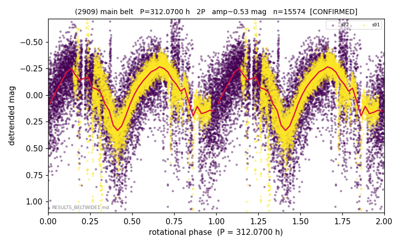

# (2909)

**Adopted:** 312.07 h, 2P, CONFIRMED

<!-- AUTO:START (regenerated from pipeline outputs; do not hand-edit this block) -->
## Evidence (auto)

Detected in 2 sector(s):

| sector | N | baseline (h) | P_phot (h) | power | FAP | cycles | flags |
|--|--|--|--|--|--|--|--|
| s72 | 8813 | 605.2 | 157.6883 | 0.2543 | 0.0e+00 | 3.8 | 2P-untestable,2P-ambiguous |
| s91 | 6814 | 641.9 | 154.38 | 0.6469 | 0.0e+00 | 2.1 | star-cleaned:78 |

- Refined shape: **2P** (folded amp_fourier 0.518); flags: few-cycle:1.9;sector-dropped:s91(range>3mag);sick-dips-excised:s72(18)
- DIA (de-comb): inconclusive(dPW=+27%,R2=0.25,s91@156.034h)
- Gates: FAP<1e-3 and power>=0.10 per detecting sector; >=2 sectors agree (harmonic-aware); folded-amplitude rule -> 2P.

<!-- AUTO:END -->
