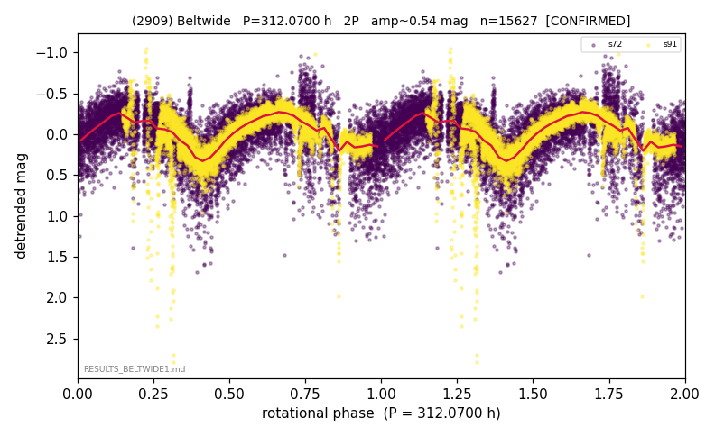

# (2909)

**Adopted:** 312.07 h, 2P, CONFIRMED

<!-- AUTO:START (regenerated from pipeline outputs; do not hand-edit this block) -->
## Evidence (auto)

Detected in 2 sector(s):

| sector | N | baseline (h) | P_phot (h) | power | FAP | cycles | flags |
|--|--|--|--|--|--|--|--|
| s72 | 8813 | 605.2 | 157.6883 | 0.2543 | 0.0e+00 | 3.8 | 2P-untestable,2P-ambiguous |
| s91 | 6814 | 641.9 | 154.38 | 0.6469 | 0.0e+00 | 2.1 | star-cleaned:78 |

- Pipeline refine said: **2P** (folded amp_fourier 0.503); flags: amp-from-clean-sectors(ignored s72);few-cycle:2.1;gap-alias-risk:138h;sick-dips-excised:s7
- DIA (de-comb): outofrange_v2(ret=0.781[0.69-0.82],s91@156.034h)
- Coverage: **2 sector(s)**, best sector covers **2.06 cycles** of the adopted period. Measured periodogram peak width 21% of the period, i.e. about **+/- 14.2 h** (1 sigma); the decimal places in the adopted value are not a precision claim.
- Factor of two: **confirmed against an independently published determination** (stronger than any internal test).
- Gates: FAP<1e-3 and power>=0.10 per detecting sector; >=2 sectors agree (harmonic-aware).
- Adopted shape: **2P** (folded-amplitude rule; pipeline agrees).

### Why this row reads the way it does

- ultra-slow; confirms Hanus+2021 sidereal 311.3h; P_sid=310.43h Theta=0.437 super-slow (near bar,short baseline)

<!-- AUTO:END -->
