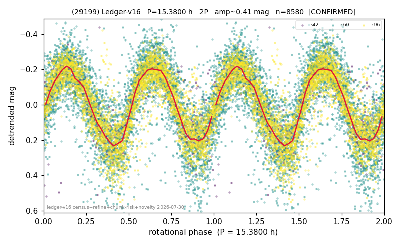

# (29199)

**Adopted:** 15.38 h, 2P, CONFIRMED

<!-- AUTO:START (regenerated from pipeline outputs; do not hand-edit this block) -->
## Evidence (auto)

Detected in 3 sector(s):

| sector | N | baseline (h) | P_phot (h) | power | FAP | cycles | flags |
|--|--|--|--|--|--|--|--|
| s42 | 829 | 343.0 | 7.6896 | 0.7835 | 3.4e-270 | 44.6 | star-cleaned:15,2P-ambiguous |
| s60 | 4102 | 308.4 | 7.693 | 0.5551 | 0.0e+00 | 40.1 | star-cleaned:22,2P-ambiguous |
| s96 | 3698 | 246.8 | 7.6772 | 0.7155 | 0.0e+00 | 32.2 | 2P-ambiguous |

- Pipeline refine said: **2P** (folded amp_fourier 0.449); flags: amp-from-clean-sectors(ignored s60);sick-dips-excised:s42(2),s60(12);near-threshold:0.45
- DIA (de-comb): survived(dPW=+3%,R2=0.07,s96@7.690h,4sec)
- Coverage: **3 sector(s)**, best sector covers **22.3 cycles** of the adopted period. Measured periodogram peak width 2% of the period, i.e. about **+/- 0.05659 h** (1 sigma); the decimal places in the adopted value are not a precision claim.
- Factor of two: **adopted on the amplitude convention**: standard practice for an elongated body, but a convention rather than a measurement.
- Gates: FAP<1e-3 and power>=0.10 per detecting sector; >=2 sectors agree (harmonic-aware).
- Adopted shape: **2P** (folded-amplitude rule; pipeline agrees).

### Why this row reads the way it does

- 3 sector(s) detecting
- cross-sector fold correlation 0.98
- doubling BY CONVENTION: amplitude rule on folded amp 0.449 mag, not individually audited

<!-- AUTO:END -->
