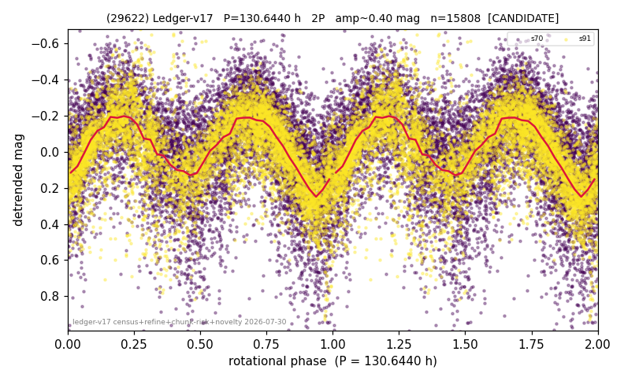

# (29622)

**Adopted:** 130.644 h, 2P, CANDIDATE

<!-- AUTO:START (regenerated from pipeline outputs; do not hand-edit this block) -->
## Evidence (auto)

Detected in 2 sector(s):

| sector | N | baseline (h) | P_phot (h) | power | FAP | cycles | flags |
|--|--|--|--|--|--|--|--|
| s70 | 8746 | 599.8 | 65.5668 | 0.2501 | 0.0e+00 | 9.1 | star-cleaned:164,2P-ambiguous |
| s91 | 7166 | 627.1 | 65.077 | 0.5271 | 0.0e+00 | 4.8 | star-cleaned:89 |

- Pipeline refine said: **2P** (folded amp_fourier 0.412); flags: amp-from-clean-sectors(ignored s70);near-comb(amp-cleared):n=5;gap-alias-risk:111h;sick-di
- DIA (de-comb): survived(dPW=+7%,R2=0.02,s91@65.322h,3sec)
- Gates: FAP<1e-3 and power>=0.10 per detecting sector; single strong sector (candidate ceiling).
- Adopted shape: **2P** (folded-amplitude rule; pipeline agrees).

### Why this row reads the way it does

- 2 sector(s) detecting
- cross-sector fold correlation 0.94
- doubling BY CONVENTION: amplitude rule on folded amp 0.412 mag, not individually audited
- CHUNK QUARANTINE (SUPPRESSED): the adopted period is at least half the extraction chunk span, and median-matching the chunks removes variation slower than one chunk. Needs a direct re-extraction before this period can be claimed

<!-- AUTO:END -->
