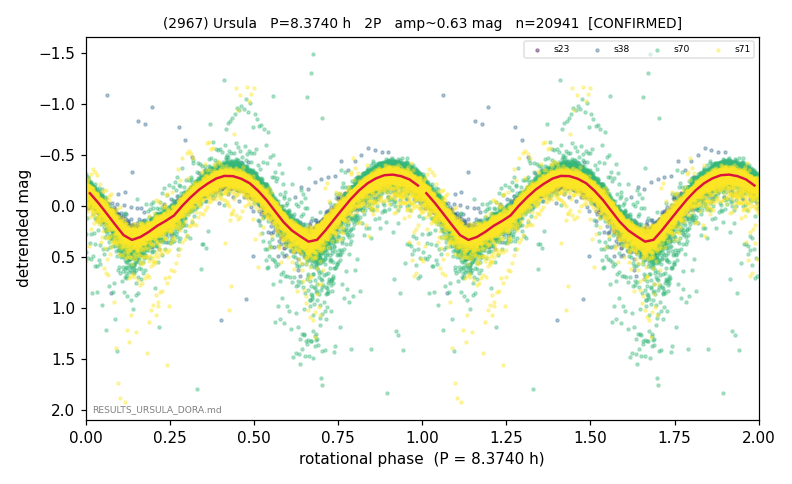

# (2967)

**Adopted:** 8.374 h, 2P, CONFIRMED

<!-- AUTO:START (regenerated from pipeline outputs; do not hand-edit this block) -->
## Evidence (auto)

Detected in 4 sector(s):

| sector | N | baseline (h) | P_phot (h) | power | FAP | cycles | flags |
|--|--|--|--|--|--|--|--|
| s23 | 756 | 593.0 | 4.187 | 0.9548 | 0.0e+00 | 141.6 | 2P-ambiguous |
| s38 | 2809 | 635.3 | 4.1875 | 0.8108 | 0.0e+00 | 151.7 | star-cleaned:12,2P-ambiguous |
| s70 | 8663 | 598.0 | 4.1874 | 0.8606 | 0.0e+00 | 142.8 | star-cleaned:34,2P-ambiguous |
| s71 | 8713 | 608.4 | 4.1865 | 0.8722 | 0.0e+00 | 145.3 | star-cleaned:4,2P-ambiguous |

- Pipeline refine said: **2P** (folded amp_fourier 0.736); flags: sick-dips-excised:s70(68),s71(15)
- DIA (de-comb): survived_v2(ret=1.000[1.00-1.00],s23@4.187h)
- Coverage: **4 sector(s)**, best sector covers **75.87 cycles** of the adopted period. Measured periodogram peak width 1% of the period, i.e. about **+/- 0.01027 h** (1 sigma); the decimal places in the adopted value are not a precision claim.
- Factor of two: **adopted on the amplitude convention**: standard practice for an elongated body, but a convention rather than a measurement.
- Gates: FAP<1e-3 and power>=0.10 per detecting sector; >=2 sectors agree (harmonic-aware).
- Adopted shape: **2P** (folded-amplitude rule; pipeline agrees).

### Why this row reads the way it does

- base 4.1875h x4 sectors/3.6yr alias-free; 2P by amplitude convention (amp 0.63)

<!-- AUTO:END -->
