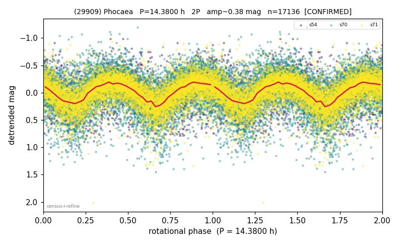

# (29909)

**Adopted:** 14.38 h, 2P, CONFIRMED

<!-- AUTO:START (regenerated from pipeline outputs; do not hand-edit this block) -->
## Evidence (auto)

Detected in 3 sector(s):

| sector | N | baseline (h) | P_phot (h) | power | FAP | cycles | flags |
|--|--|--|--|--|--|--|--|
| s54 | 1066 | 278.3 | 7.2109 | 0.0677 | 1.2e-12 | 38.6 | clean |
| s70 | 8363 | 594.2 | 7.1903 | 0.1871 | 0.0e+00 | 82.6 | star-cleaned:71,2P-ambiguous |
| s71 | 7707 | 608.3 | 7.1902 | 0.3562 | 0.0e+00 | 84.6 | star-cleaned:71,2P-ambiguous |

- Pipeline refine said: **2P** (folded amp_fourier 0.42); flags: sick-dips-excised:s70(16),s71(36);near-threshold:0.42
- DIA (de-comb): survived_v2(ret=1.001[1.00-1.00],s71@7.190h)
- Coverage: **3 sector(s)**, best sector covers **42.3 cycles** of the adopted period. Measured periodogram peak width 1% of the period, i.e. about **+/- 0.03207 h** (1 sigma); the decimal places in the adopted value are not a precision claim.
- Factor of two: **adopted on the amplitude convention**: standard practice for an elongated body, but a convention rather than a measurement.
- Gates: FAP<1e-3 and power>=0.10 per detecting sector; >=2 sectors agree (harmonic-aware).
- Adopted shape: **2P** (folded-amplitude rule; pipeline agrees).

### Why this row reads the way it does

- DOUBLED 1P->2P 7.19->14.38h (high-amp 1P audit 2026-07-18: folded amp 0.409 = elongated/double-peaked; house rule amp>0.40->2P).

<!-- AUTO:END -->
