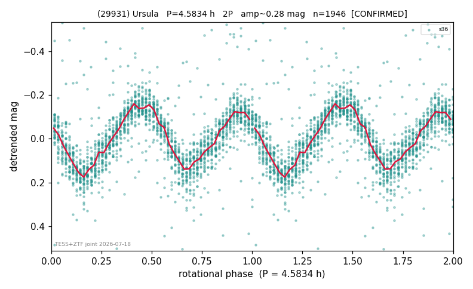

# (29931)

**Adopted:** 4.5834 h, 2P, CONFIRMED

<!-- AUTO:START (regenerated from pipeline outputs; do not hand-edit this block) -->
## Evidence (auto)

Detected in 1 sector(s):

| sector | N | baseline (h) | P_phot (h) | power | FAP | cycles | flags |
|--|--|--|--|--|--|--|--|
| s36 | 1959 | 419.7 | 2.2917 | 0.6307 | 0.0e+00 | 183.1 | star-cleaned:16,2P-ambiguous |

- Pipeline refine said: **1P** (folded amp_fourier 0.292); flags: sick-dips-excised:s36(8)
- DIA (de-comb): survived(dPW=+2%,R2=0.05,s36@2.292h,1sec)
- Gates: FAP<1e-3 and power>=0.10 per detecting sector; >=2 sectors agree (harmonic-aware).
- **Adopted shape 2P OVERRIDES the pipeline's 1P** (doubling audit 2026-07-25: folded amplitude >= 0.25 mag, so a single-peaked curve is physically implausible; Harris convention -> 2P. The census 3-test doubling logic was measured at only 30% recall against 289 LCDB U>=2 ground-truth periods).

<!-- AUTO:END -->
