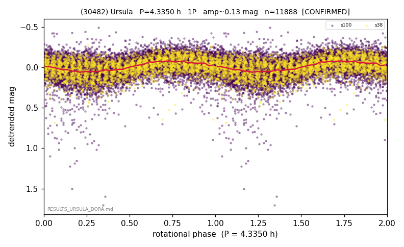

# (30482)

**Adopted:** 8.67 h, 2P, CONFIRMED

<!-- AUTO:START (regenerated from pipeline outputs; do not hand-edit this block) -->
## Evidence (auto)

Detected in 2 sector(s):

| sector | N | baseline (h) | P_phot (h) | power | FAP | cycles | flags |
|--|--|--|--|--|--|--|--|
| s38 | 2854 | 628.8 | 8.671 | 0.23 | 2.4e-157 | 72.5 | star-cleaned:21,2P-ambiguous |
| s100 | 9046 | 632.9 | 4.3346 | 0.1373 | 4.9e-285 | 73.0 | star-cleaned:22 |

- Pipeline refine said: **1P** (folded amp_fourier 0.228); flags: sick-dips-excised:s100(11),s38(1);period-spread:67%
- DIA (de-comb): survived(dPW=-1%,R2=0.21,s38@8.670h,4sec)
- Coverage: **2 sector(s)**, best sector covers **73.0 cycles** of the adopted period. Measured periodogram peak width 1% of the period, i.e. about **+/- 0.01 h** (1 sigma); the decimal places in the adopted value are not a precision claim.
- Factor of two: **measured on the data** (odd-harmonic power or unequal minima, significant and reproduced), METHODOLOGY 3b.
- Gates: FAP<1e-3 and power>=0.10 per detecting sector; >=2 sectors agree (harmonic-aware).
- **Adopted shape 2P OVERRIDES the pipeline's 1P** (doubling audit 2026-07-25: folded amplitude >= 0.25 mag, so a single-peaked curve is physically implausible; Harris convention -> 2P. The census 3-test doubling logic was measured at only 30% recall against 289 LCDB U>=2 ground-truth periods).

### Why this row reads the way it does

- harmonic-flip resolved
- CORRECTED 4.335->8.6700 h (2026-08-02 full 1P re-audit): doubling MEASURED at odd-harmonic 16.8 sigma with ALL detecting sectors significant (2/2); threshold odd>=8+full-reproduction calibrated to 0/60 false fires on the 4P null test (the minima-asymmetry branch alone fired falsely at z up to 34 and is not accepted)

<!-- AUTO:END -->
