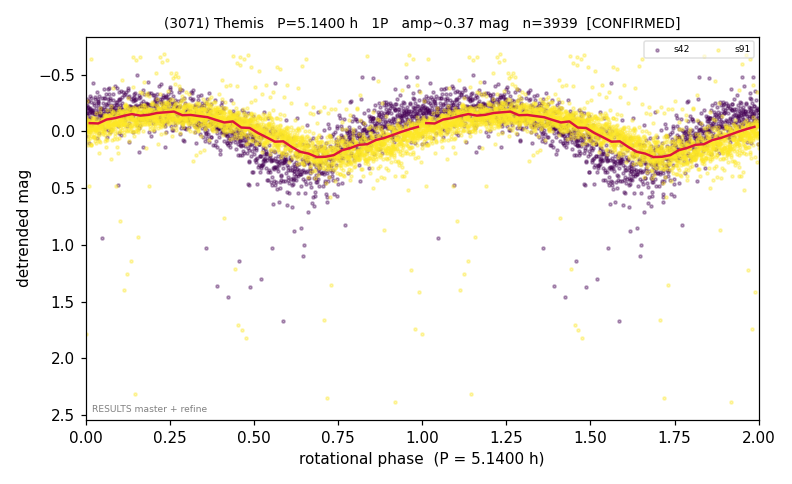

# (3071)

**Adopted:** 5.14 h, 1P, CONFIRMED

<!-- AUTO:START (regenerated from pipeline outputs; do not hand-edit this block) -->
## Evidence (auto)

Detected in 2 sector(s):

| sector | N | baseline (h) | P_phot (h) | power | FAP | cycles | flags |
|--|--|--|--|--|--|--|--|
| s42 | 1402 | 440.8 | 5.1396 | 0.6198 | 2.3e-289 | 85.8 | star-cleaned:2,2P-ambiguous |
| s91 | 2537 | 167.7 | 5.1413 | 0.5334 | 0.0e+00 | 32.6 | star-cleaned:14,2P-ambiguous |

- Refined shape: **2P** (folded amp_fourier 0.554); flags: sector-dropped:s91(range>3mag);sick-dips-excised:s42(6)
- DIA (de-comb): survived(dPW=+2%,R2=0.07,s42@5.140h,3sec)
- Gates: FAP<1e-3 and power>=0.10 per detecting sector; >=2 sectors agree (harmonic-aware); folded-amplitude rule -> 1P.

<!-- AUTO:END -->
