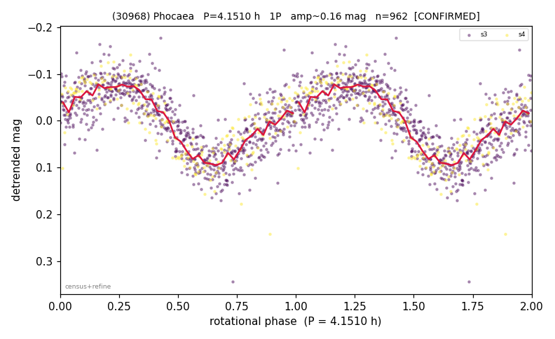

# (30968)

**Adopted:** 4.151 h, 1P, CONFIRMED

<!-- AUTO:START (regenerated from pipeline outputs; do not hand-edit this block) -->
## Evidence (auto)

Detected in 2 sector(s):

| sector | N | baseline (h) | P_phot (h) | power | FAP | cycles | flags |
|--|--|--|--|--|--|--|--|
| s3 | 750 | 482.0 | 4.1485 | 0.6695 | 1.4e-175 | 116.2 | 2P-ambiguous |
| s4 | 212 | 115.5 | 4.1536 | 0.706 | 2.5e-52 | 27.8 | clean |

- Refined shape: **1P** (folded amp_fourier 0.185); flags: clean
- DIA (de-comb): not triggered (clean, fast, non-comb)
- Gates: FAP<1e-3 and power>=0.10 per detecting sector; >=2 sectors agree (harmonic-aware); folded-amplitude rule -> 1P.

<!-- AUTO:END -->
