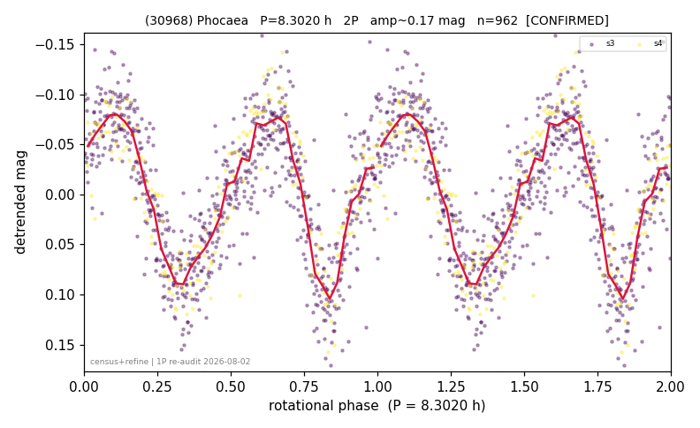

# (30968)

**Adopted:** 8.302 h, 2P, CONFIRMED

<!-- AUTO:START (regenerated from pipeline outputs; do not hand-edit this block) -->
## Evidence (auto)

Detected in 2 sector(s):

| sector | N | baseline (h) | P_phot (h) | power | FAP | cycles | flags |
|--|--|--|--|--|--|--|--|
| s3 | 750 | 482.0 | 4.1485 | 0.6695 | 1.4e-175 | 116.2 | 2P-ambiguous |
| s4 | 212 | 115.5 | 4.1536 | 0.706 | 2.5e-52 | 27.8 | clean |

- Pipeline refine said: **1P** (folded amp_fourier 0.185); flags: clean
- DIA (de-comb): not triggered (the object is clean, fast and non-comb, so the test does not apply)
- Coverage: **1 sector(s)**, best sector covers **58.06 cycles** of the adopted period. Measured periodogram peak width 1% of the period, i.e. about **+/- 0.01388 h** (1 sigma); the decimal places in the adopted value are not a precision claim.
- Factor of two: **measured on the data** (odd-harmonic power or unequal minima, significant and reproduced), METHODOLOGY 3b.
- Gates: FAP<1e-3 and power>=0.10 per detecting sector; >=2 sectors agree (harmonic-aware).
- **Adopted shape 2P OVERRIDES the pipeline's 1P** (doubling audit 2026-07-25: folded amplitude >= 0.25 mag, so a single-peaked curve is physically implausible; Harris convention -> 2P. The census 3-test doubling logic was measured at only 30% recall against 289 LCDB U>=2 ground-truth periods).

### Why this row reads the way it does

- | CORRECTED 4.151->8.3020 h (2026-08-02 full 1P re-audit): doubling MEASURED at odd-harmonic 10.4 sigma with ALL detecting sectors significant (2/2); threshold odd>=8+full-reproduction calibrated to 0/60 false fires on the 4P null test (the minima-asymmetry branch alone fired falsely at z up to 34 and is not accepted)

<!-- AUTO:END -->
