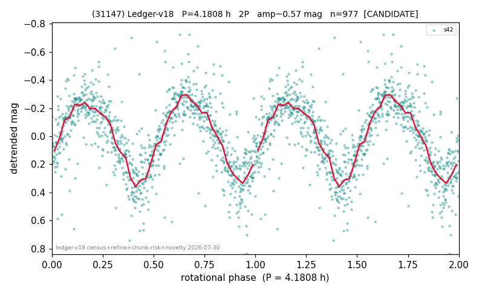

# (31147)

**Adopted:** 4.1808 h, 2P, CANDIDATE

<!-- AUTO:START (regenerated from pipeline outputs; do not hand-edit this block) -->
## Evidence (auto)

Detected in 1 sector(s):

| sector | N | baseline (h) | P_phot (h) | power | FAP | cycles | flags |
|--|--|--|--|--|--|--|--|
| s42 | 992 | 352.0 | 2.0904 | 0.5519 | 3.0e-168 | 168.4 | star-cleaned:11,2P-ambiguous |

- Pipeline refine said: **2P** (folded amp_fourier 0.579); flags: sick-dips-excised:s42(11)
- DIA (de-comb): survived(dPW=+1%,R2=0.07,s42@2.090h,1sec)
- Gates: FAP<1e-3 and power>=0.10 per detecting sector; single strong sector (candidate ceiling).
- Adopted shape: **2P** (folded-amplitude rule; pipeline agrees).

### Why this row reads the way it does

- 1 sector(s) detecting
- doubling BY CONVENTION: amplitude rule on folded amp 0.579 mag, not individually audited

<!-- AUTO:END -->
