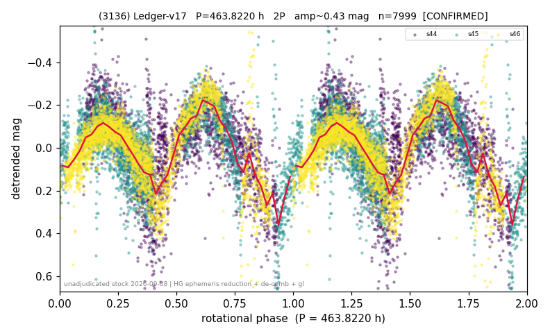

# (3136)

**Adopted:** 463.822 h, 2P, CONFIRMED

<!-- AUTO:START (regenerated from pipeline outputs; do not hand-edit this block) -->
## Evidence (auto)

Detected in 3 sector(s):

| sector | N | baseline (h) | P_phot (h) | power | FAP | cycles | flags |
|--|--|--|--|--|--|--|--|
| s44 | 2395 | 570.9 | 213.4878 | 0.3199 | 7.6e-196 | 2.7 | star-cleaned:3,phase-curve-risk,2P-untes |
| s45 | 2491 | 581.1 | 248.9685 | 0.3574 | 2.2e-234 | 2.3 | star-cleaned:9,phase-curve-risk,2P-untes |
| s46 | 3127 | 623.5 | 244.3402 | 0.4299 | 0.0e+00 | 2.6 | star-cleaned:1,phase-curve-risk,2P-untes |

- Pipeline refine said: **2P** (folded amp_fourier 0.492); flags: few-cycle:1.3;gap-alias-risk:72h;sick-dips-excised:s45(7),s46(7);incoherent-sectors:2/3;pe
- DIA (de-comb): inconclusive(dPW=+35%,R2=0.11,s45@246.654h)
- Coverage: **3 sector(s)**, best sector covers **1.34 cycles** of the adopted period. Measured periodogram peak width 43% of the period, i.e. about **+/- 42.13 h** (1 sigma); the decimal places in the adopted value are not a precision claim.
- Factor of two: **adopted on the amplitude convention**: standard practice for an elongated body, but a convention rather than a measurement.
- Gates: FAP<1e-3 and power>=0.10 per detecting sector; >=2 sectors agree (harmonic-aware).
- Adopted shape: **2P** (folded-amplitude rule; pipeline agrees).

### Why this row reads the way it does

- doubling: by convention (one prominent maximum in the fold at P1 = 231.911 h, stable in 100 per cent of block bootstraps, METHODOLOGY 3b-bis); the doubling is NOT established: the calibrated block-bootstrap test is silent (p_emp 0.334 and 0.523 at the two block lengths on 20,000 null realisations), the two minima differ by 0.9 sigma and the folded amplitude at P1 is 0.380 mag, below the 0.40 convention cut; both aliases 231.911 h and 463.822 h are to be considered
- sectors 45 and 46 cross at slow apparent speed, where the pixel-level injection test puts the recovered flux at 86 per cent with a uniform faint bias (METHODOLOGY 1b): the period and the folded amplitude are not affected, the absolute magnitude is
- verified outside the standard census pipeline (HG ephemeris reduction, single global cubic trend, trend-degree and time-half stability, de-comb): docs/results/nuovi_periodi_20260908.md and docs/results/doubling_calibrated.md

<!-- AUTO:END -->

## Why this object arrives only now
Its light curve came out of the ledger lot v17, extracted for the slow-rotator rate study
rather than for the catalog. The catalog was frozen on 2026-08-24 for the method and
catalog paper, before those lots had been adjudicated object by object, so a stock of
measured but unarbitrated periods sat outside it. This object is one of fourteen taken
out of that stock on 2026-09-08, verified, and admitted here.

## Why the per-sector table above does not show the adopted period
The AUTO block reports the **census** pass, which detrends each sector with its own
polynomial and searches sector by sector. This object was re-derived from scratch in the
2026-09-08 adjudication with a different and physically stronger reduction, so the two
sets of numbers are not meant to agree digit by digit; the adopted value is the
re-derived one. The full procedure and its per-object output are in
`docs/results/nuovi_periodi_20260908.md` and `docs/results/nuovi_periodi_20260908.csv`
in the working repository, and the doubling adjudication in
`docs/results/doubling_calibrated.md`.

## How it was verified

Not by the standard census gates alone. Each of the fourteen went through the same
battery, listed here with this object's numbers.

1. **Physical reduction.** JPL Horizons ephemerides from the TESS viewpoint (centre
   500@-95), then reduced magnitude with the HG phase function at G = 0.15, which
   removes distance and phase angle physically instead of absorbing them into a
   per-sector polynomial. Outliers rejected at 5 sigma from the robust median
   (0 points).
2. **One global trend, not one per sector.** A single cubic plus two harmonics over
   the whole 1858 h baseline, with the period search capped at
   baseline/8, that is at least eight rotations inside the data.
   Photometric period P1 = 231.9110 h, chi-squared gain 40.7 per cent.
3. **Stability against the trend degree.** The same search at polynomial degree 2, 3
   and 4 returns the same period (spread 0.5 per cent).
4. **Independent subsets.** The two time halves return 227.79 and 234.19 h,
   which is the adopted photometric period, its double, or its half, within 5 per
   cent.
5. **De-comb.** TESS orbits in 328.8 h, so any periodogram has excess power at the
   teeth 328.8/n. Verdict for this object: **inconclusive** (power change +39%, model
   R2 = 0.16).
   The photometric period sits 29.11% from the nearest tooth (164.4 h, n = 2), which is far.

## What the coverage really is
**Three consecutive detecting sectors, s44, s45 and s46**, which form one
uninterrupted 1858 h stretch covering **4.0 cycles** of the adopted 463.822 h.
The `n_cycles_best` column above reports 1.34 instead, because it is defined as the
cycles covered by the best **single** sector; for this object the two numbers are
different and both are stated rather than one being silently substituted for the
other. (The de-comb comparison below re-ran the same time split with its own
configuration and obtained 250.0 and 236.7 h before the projection and 453.6 and
239.4 h after, that is the photometric period and its double; the 227.79 and
234.19 h quoted in step 4 come from the adopted search. All four values are
consistent with P1 or 2 x P1.)

This is the only object of the fourteen with three sectors, and the strongest of
them. It is also the one whose de-comb needed a full re-analysis: in s45 the
instrumental model carries power 0.398 at the candidate period and the folded
amplitude drops 23 per cent, so the whole analysis was repeated on the de-combed
curves. The result strengthens the detection: the period at polynomial degrees 2, 3
and 4 becomes identical to three decimals (229.513 h in all three, against 232.6,
231.5 and 231.4 h before), the chi-squared gain **rises** from 40.7 to 47.2 per
cent, the folded amplitude is preserved to 2.3 per cent (0.458 against 0.469 mag),
and the rotation period from the de-combed data is 459.027 h, 1 per cent from the
adopted 463.822 h. Removing the instrument makes the signal cleaner, which is the
opposite of what an instrumental artefact does. The adopted value stays the one
measured on the standard curves; note that the doubling adjudication used that
same P1 = 231.911 h and not the de-combed 229.513 h.

## The factor of two

Decided with the **calibrated** test of METHODOLOGY 3b-bis, not with the nominal
odd-harmonic F test. That test was validated on 174 external LCDB labels in the same
pass and found **not calibrated**: it declares a doubling for 44 of the 62 objects
whose published period equals our photometric period, specificity 0.290. Its nominal
p-values are not quoted anywhere in this entry. The calibrated replacement draws its
significance from a block bootstrap under the single-peaked hypothesis, 20,000
realisations at two block lengths.

| quantity at P1 = 231.9110 h | value |
|--|--|
| calibrated p, 1 d blocks | 0.33428 |
| calibrated p, 2 d blocks | 0.52257 |
| unequal minima, z above the null mean | +0.94 |
| prominent maxima in the fold (stability) | 1 (100 per cent) |
| folded amplitude at P1 | 0.380 mag |

**Adopted by convention, and the doubling is not established.** The fold at
231.9110 h has a single prominent maximum, stable in 100 per cent of the
block bootstraps, which is the topological form of the standard doubling
convention (an elongated body shows two maxima per rotation). On the 174 external
labels that criterion has specificity 1.000 and sensitivity 0.759, better than the
0.871 of the amplitude form, but it is **post-hoc**: it was found by diagnosing the
amplitude rule's failures on those same labels and has no prospective test yet.
The calibrated test is silent and the minima do not differ significantly, so there
is **no per-object evidence** of the odd harmonic. If the convention did not hold,
the rotation period would be 231.9110 h; **both aliases are to be considered.**

## Novelty
Checked on **both** gates together on 2026-09-08, the LCDB 2023 summary **and** the
SsODNet `ssoCard` spins field: neither carries a rotation period for this object
(`docs/results/gap_hunt_20260905.md`, `novel_both_gates_20260908.csv` in the working
repository). One gate is not enough in either direction: of 72 objects SsODNet
reported without a spin, 36 already had an LCDB period, and three objects of the same
sweep are absent from the LCDB summary but carry an SsODNet spin. This is a first
determination on both.

## Verdict
CONFIRMED 2P / 463.822 h. The factor of two is adopted by convention and has no per-object evidence; the alias 231.9110 h is to be considered alongside it.

This is the longest rotation period in the catalog. It rests on a doubling that
is adopted by convention and not measured, and on a periodogram peak 43 per cent
wide, so it is quoted with those two caveats attached and not used as a bare
headline number.
