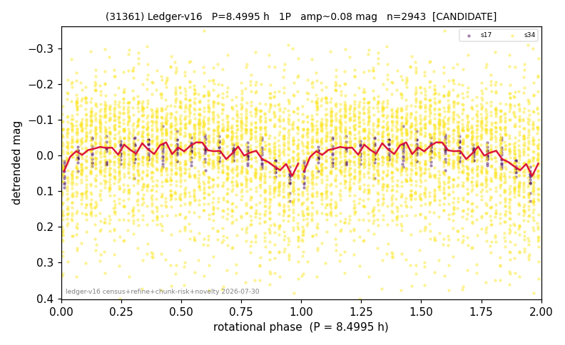

# (31361)

**Adopted:** 8.4995 h, 1P, CANDIDATE

<!-- AUTO:START (regenerated from pipeline outputs; do not hand-edit this block) -->
## Evidence (auto)

Detected in 2 sector(s):

| sector | N | baseline (h) | P_phot (h) | power | FAP | cycles | flags |
|--|--|--|--|--|--|--|--|
| s17 | 210 | 138.5 | 8.4995 | 0.3215 | 1.3e-14 | 16.3 | clean |
| s34 | 2748 | 598.2 | 8.5082 | 0.0142 | 9.5e-05 | 70.3 | star-cleaned:32 |

- Pipeline refine said: **1P** (folded amp_fourier 0.06); flags: clean
- DIA (de-comb): **NOT RUN for this lot.** No de-comb verdict exists for this object, so momentum-dump contamination has not been excluded by that test here.
- Gates: FAP<1e-3 and power>=0.10 per detecting sector; single strong sector (candidate ceiling).
- Adopted shape: **1P** (folded-amplitude rule; pipeline agrees).

### Why this row reads the way it does

- 1 sector(s) detecting
- single-peaked at folded amp 0.060 mag

<!-- AUTO:END -->
