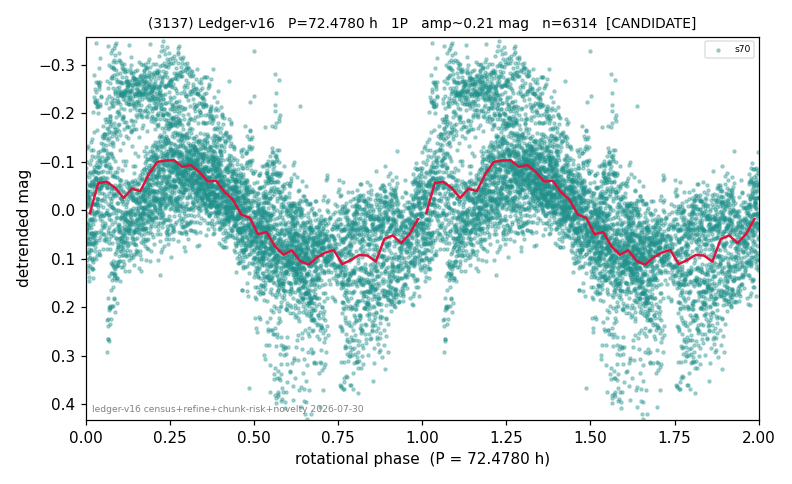

# (3137)

**Adopted:** 72.478 h, 1P, CANDIDATE

<!-- AUTO:START (regenerated from pipeline outputs; do not hand-edit this block) -->
## Evidence (auto)

Detected in 1 sector(s):

| sector | N | baseline (h) | P_phot (h) | power | FAP | cycles | flags |
|--|--|--|--|--|--|--|--|
| s70 | 6349 | 545.0 | 72.478 | 0.4105 | 0.0e+00 | 7.5 | star-cleaned:13,2P-ambiguous |

- Pipeline refine said: **1P** (folded amp_fourier 0.266); flags: few-cycle:3.8;gap-alias-risk:105h;sick-dips-excised:s70(32)
- DIA (de-comb): survived(dPW=+6%,R2=0.24,s70@72.478h,2sec)
- Coverage: **1 sector(s)**, best sector covers **7.52 cycles** of the adopted period. Measured periodogram peak width 11% of the period, i.e. about **+/- 3.25 h** (1 sigma); the decimal places in the adopted value are not a precision claim.
- Factor of two: no doubling was applied.
- Gates: FAP<1e-3 and power>=0.10 per detecting sector; single strong sector (candidate ceiling).
- Adopted shape: **1P** (folded-amplitude rule; pipeline agrees).

### Why this row reads the way it does

- 1 sector(s) detecting
- single-peaked at folded amp 0.266 mag
- pipeline flag: few-cycle

<!-- AUTO:END -->
