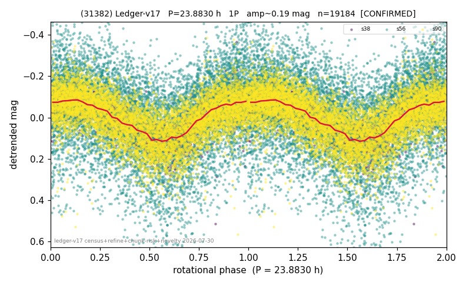

# (31382)

**Adopted:** 47.766 h, 2P, CONFIRMED

<!-- AUTO:START (regenerated from pipeline outputs; do not hand-edit this block) -->
## Evidence (auto)

Detected in 3 sector(s):

| sector | N | baseline (h) | P_phot (h) | power | FAP | cycles | flags |
|--|--|--|--|--|--|--|--|
| s38 | 2853 | 631.0 | 23.8829 | 0.5558 | 0.0e+00 | 26.4 | star-cleaned:18,2P-ambiguous |
| s56 | 8409 | 620.4 | 23.893 | 0.14 | 2.5e-270 | 26.0 | star-cleaned:1,2P-ambiguous |
| s90 | 8004 | 568.2 | 23.8455 | 0.3789 | 0.0e+00 | 23.8 | star-cleaned:34,2P-ambiguous |

- Pipeline refine said: **1P** (folded amp_fourier 0.214); flags: amp-from-clean-sectors(ignored s56);dump-alias-suspect:n=14;sick-dips-excised:s56(8),s90(1
- DIA (de-comb): survived_v2(ret=0.990[0.98-0.99],s38@23.883h)
- Coverage: **3 sector(s)**, best sector covers **26.42 cycles** of the adopted period. Measured periodogram peak width 3% of the period, i.e. about **+/- 0.3355 h** (1 sigma); the decimal places in the adopted value are not a precision claim.
- Factor of two: no doubling was applied.
- Gates: FAP<1e-3 and power>=0.10 per detecting sector; >=2 sectors agree (harmonic-aware).
- **Adopted shape 2P OVERRIDES the pipeline's 1P** (doubling audit 2026-07-25: folded amplitude >= 0.25 mag, so a single-peaked curve is physically implausible; Harris convention -> 2P. The census 3-test doubling logic was measured at only 30% recall against 289 LCDB U>=2 ground-truth periods).

### Why this row reads the way it does

- 3 sector(s) detecting
- cross-sector fold correlation 0.96
- single-peaked at folded amp 0.214 mag
- pipeline flag: dump-alias-suspect
- DOUBLING CORRECTED 2026-08-30: adopted period doubled from 23.883 h. The previous value came from the folded-amplitude rule, which was found biased low (9 of 9 disagreements with MPB 2024-2026 in the same direction). Odd-harmonic test at the long period gives z1=7.25 with margin 5.32 over non-harmonic multiples 1.7x/2.3x (reference group: 0 of 38 above margin 2).

<!-- AUTO:END -->
