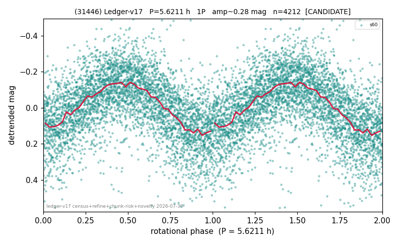

# (31446)

**Adopted:** 5.6211 h, 1P, CANDIDATE

<!-- AUTO:START (regenerated from pipeline outputs; do not hand-edit this block) -->
## Evidence (auto)

Detected in 1 sector(s):

| sector | N | baseline (h) | P_phot (h) | power | FAP | cycles | flags |
|--|--|--|--|--|--|--|--|
| s60 | 4237 | 304.2 | 5.6211 | 0.3408 | 0.0e+00 | 54.1 | star-cleaned:78,2P-ambiguous |

- Pipeline refine said: **1P** (folded amp_fourier 0.296); flags: sick-dips-excised:s60(14)
- DIA (de-comb): survived(dPW=+1%,R2=0.01,s60@5.621h,2sec)
- Gates: FAP<1e-3 and power>=0.10 per detecting sector; single strong sector (candidate ceiling).
- Adopted shape: **1P** (folded-amplitude rule; pipeline agrees).

### Why this row reads the way it does

- 1 sector(s) detecting
- single-peaked at folded amp 0.296 mag

<!-- AUTO:END -->
