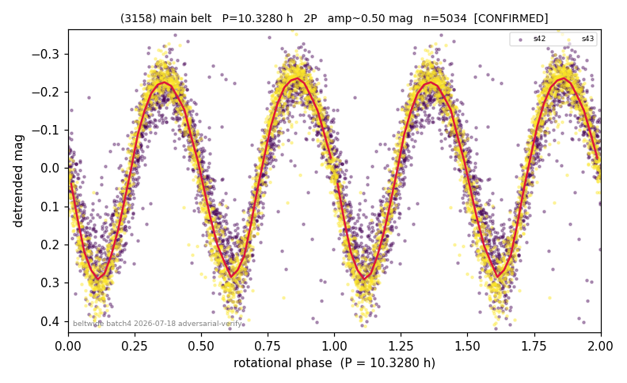

# (3158)

**Adopted:** 10.328 h, 2P, CONFIRMED

<!-- AUTO:START (regenerated from pipeline outputs; do not hand-edit this block) -->
## Evidence (auto)

Detected in 2 sector(s):

| sector | N | baseline (h) | P_phot (h) | power | FAP | cycles | flags |
|--|--|--|--|--|--|--|--|
| s42 | 2649 | 610.4 | 5.1646 | 0.8452 | 0.0e+00 | 118.2 | star-cleaned:7,2P-ambiguous |
| s43 | 2401 | 593.2 | 5.1642 | 0.9346 | 0.0e+00 | 114.9 | 2P-ambiguous |

- Refined shape: **2P** (folded amp_fourier 0.471); flags: sector-dropped:s43(range>3mag);sick-dips-excised:s42(5)
- DIA (de-comb): survived(dPW=+6%,R2=0.37,s43@5.164h,2sec)
- Gates: FAP<1e-3 and power>=0.10 per detecting sector; >=2 sectors agree (harmonic-aware); folded-amplitude rule -> 2P.

<!-- AUTO:END -->
