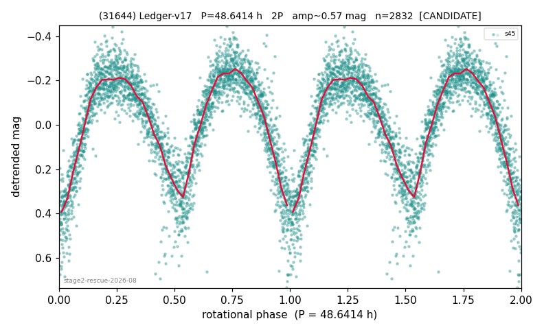

# (31644)

**Adopted:** 48.6414 h, 2P, CONFIRMED

<!-- AUTO:START (regenerated from pipeline outputs; do not hand-edit this block) -->
## Evidence (auto)

Detected in 2 sector(s):

| sector | N | baseline (h) | P_phot (h) | power | FAP | cycles | flags |
|--|--|--|--|--|--|--|--|
| s44 | 2761 | 570.7 | 24.2771 | 0.6027 | 0.0e+00 | 23.5 | star-cleaned:3,2P-ambiguous |
| s45 | 2854 | 585.5 | 24.3207 | 0.7473 | 0.0e+00 | 24.1 | 2P-ambiguous |

- Coverage: **2 sector(s)**, best sector covers **12.04 cycles** of the adopted period. Measured periodogram peak width 3% of the period, i.e. about **+/- 0.3525 h** (1 sigma); the decimal places in the adopted value are not a precision claim.
- Factor of two: **adopted on the amplitude convention**: standard practice for an elongated body, but a convention rather than a measurement.
- Gates: FAP<1e-3 and power>=0.10 per detecting sector; >=2 sectors agree (harmonic-aware).
- Adopted shape: **2P** (folded-amplitude rule; pipeline agrees).

### Why this row reads the way it does

- stage-2 crowding-rescue harvest (|b| 5-15 deg, METHODOLOGY 5b-ter), verified 2026-08-10 by refutation-first waves: blind LS+PDM re-derivation, harmonic-aware comb test, field control where near-comb (LS power at the same frequency on >=15 unknown objects of the same sector), shape rules per 3b, all vetoes checked
- 2P by amplitude rule (folded_amp=0.58)
- 1 sector(s) detecting; single strong sector (candidate ceiling)
- s44/s45: own peaks 24.29/24.36h, power 0.607/0.623, null-calibrated gate 0/200 both sectors, half-split dev <=1%, spectral window clean at P_phot~1.013d (pw 0.003-0.009), FIELD CONTROL 148x/196x above field median (bar 39x, 5b-ter)
- folded amp 0.694 -> 2P
- PROMOTED CANDIDATE->CONFIRMED (adversarial pass 2026-08-15)

<!-- AUTO:END -->
