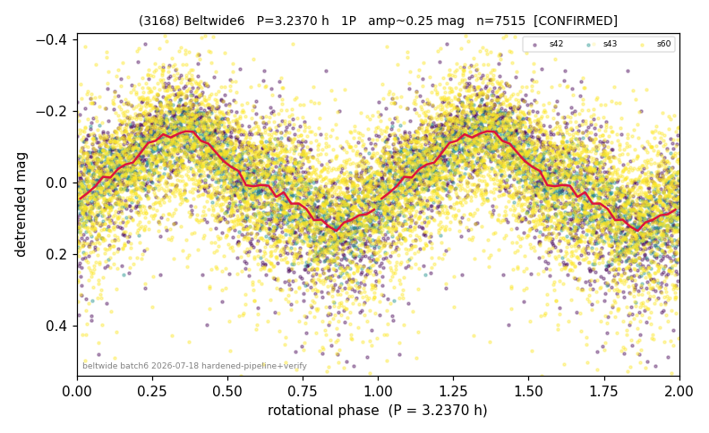

# (3168)

**Adopted:** 3.237 h, 1P, CONFIRMED

<!-- AUTO:START (regenerated from pipeline outputs; do not hand-edit this block) -->
## Evidence (auto)

Detected in 3 sector(s):

| sector | N | baseline (h) | P_phot (h) | power | FAP | cycles | flags |
|--|--|--|--|--|--|--|--|
| s42 | 2014 | 599.9 | 3.2359 | 0.4116 | 3.2e-227 | 185.4 | star-cleaned:78,2P-ambiguous |
| s43 | 1333 | 372.4 | 3.2375 | 0.6375 | 1.2e-288 | 115.0 | 2P-ambiguous |
| s60 | 4212 | 303.5 | 3.2379 | 0.2846 | 2.1e-301 | 93.7 | star-cleaned:11,2P-ambiguous |

- Pipeline refine said: **1P** (folded amp_fourier 0.294); flags: sick-dips-excised:s42(9),s43(2),s60(21)
- DIA (de-comb): survived(dPW=+10%,R2=0.22,s43@3.237h,3sec)
- Gates: FAP<1e-3 and power>=0.10 per detecting sector; >=2 sectors agree (harmonic-aware).
- Adopted shape: **1P** (folded-amplitude rule; pipeline agrees).

### Why this row reads the way it does

- REVIEW-FLAG: folded_amp=0.23. All 3 sectors independently detect 3.236-3.238h at FAP~1e-240 to 1e-306 (spread <0.1%), including s42/s43 once the handful (13-24 of ~2000-4200 pts, <1.5%) of faint contamination outliers driving the >3mag flag

<!-- AUTO:END -->
