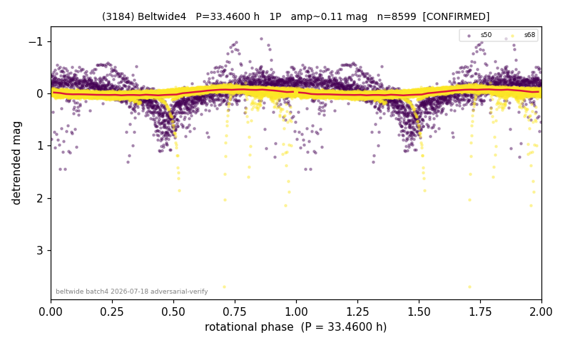

# (3184)

**Adopted:** 33.46 h, 1P, CONFIRMED

<!-- AUTO:START (regenerated from pipeline outputs; do not hand-edit this block) -->
## Evidence (auto)

Detected in 2 sector(s):

| sector | N | baseline (h) | P_phot (h) | power | FAP | cycles | flags |
|--|--|--|--|--|--|--|--|
| s50 | 2110 | 626.8 | 33.4091 | 0.3584 | 1.3e-198 | 18.8 | star-cleaned:26,2P-ambiguous |
| s68 | 6489 | 504.1 | 33.5137 | 0.2513 | 0.0e+00 | 15.0 | clean |

- Refined shape: **2P** (folded amp_fourier 0.481); flags: near-comb(amp-cleared):n=5,10;gap-alias-risk:125h;sector-dropped:s68(range>3mag);sick-dips
- DIA (de-comb): survived(dPW=+12%,R2=0.08,s50@33.461h,4sec)
- Gates: FAP<1e-3 and power>=0.10 per detecting sector; >=2 sectors agree (harmonic-aware); folded-amplitude rule -> 1P.

<!-- AUTO:END -->
