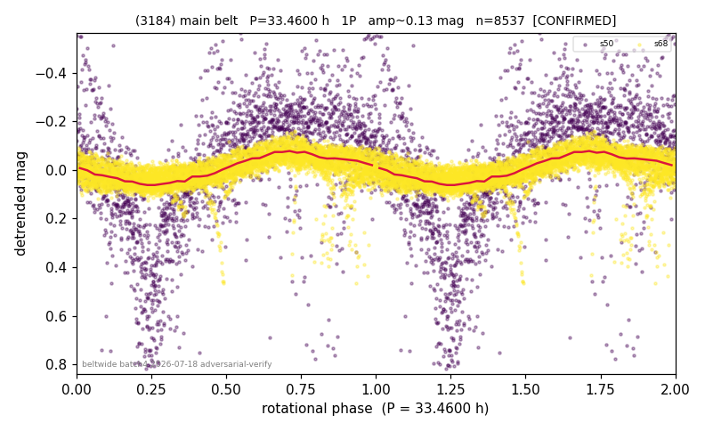

# (3184)

**Adopted:** 33.46 h, 1P, CONFIRMED

<!-- AUTO:START (regenerated from pipeline outputs; do not hand-edit this block) -->
## Evidence (auto)

Detected in 2 sector(s):

| sector | N | baseline (h) | P_phot (h) | power | FAP | cycles | flags |
|--|--|--|--|--|--|--|--|
| s50 | 2110 | 626.8 | 33.4091 | 0.3584 | 1.3e-198 | 18.8 | star-cleaned:26,2P-ambiguous |
| s68 | 6489 | 504.1 | 33.5137 | 0.2513 | 0.0e+00 | 15.0 | clean |

- Pipeline refine said: **1P** (folded amp_fourier 0.115); flags: amp-from-clean-sectors(ignored s50);dump-alias-suspect:n=10;sick-dips-excised:s50(4),s68(1
- DIA (de-comb): survived(dPW=+12%,R2=0.08,s50@33.461h,4sec)
- Gates: FAP<1e-3 and power>=0.10 per detecting sector; >=2 sectors agree (harmonic-aware).
- Adopted shape: **1P** (folded-amplitude rule; pipeline agrees).

### Why this row reads the way it does

- S68 (mag13.7, folded amp 0.12=genuine 1P, FAP~0) is the CLEAN reference; S50 (mag16.3 faint apparition, field-crossings) inflates shape but its cleaned period 33.42h agrees with S68 33.51h to 0.28%. 33.46h/1P CONFIRMED holds

<!-- AUTO:END -->
