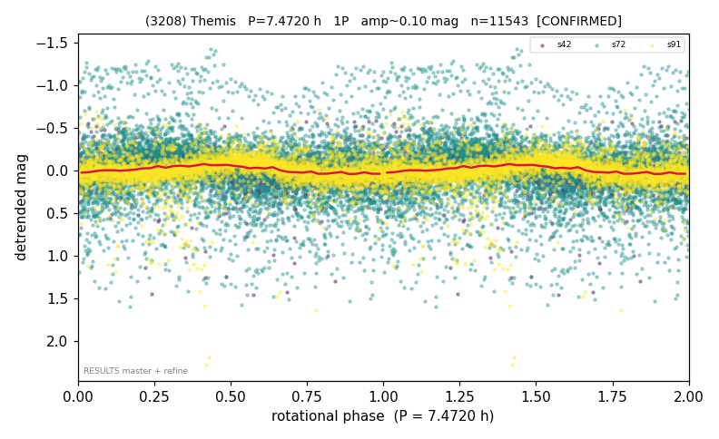

# (3208)

**Adopted:** 7.472 h, 1P, CONFIRMED

<!-- AUTO:START (regenerated from pipeline outputs; do not hand-edit this block) -->
## Evidence (auto)

Detected in 3 sector(s):

| sector | N | baseline (h) | P_phot (h) | power | FAP | cycles | flags |
|--|--|--|--|--|--|--|--|
| s42 | 1808 | 514.7 | 7.4758 | 0.146 | 6.8e-58 | 68.8 | star-cleaned:46,2P-ambiguous |
| s72 | 5466 | 574.9 | 106.6115 | 0.2007 | 9.2e-261 | 2.7 | star-cleaned:269 |
| s91 | 4269 | 294.7 | 7.4682 | 0.1254 | 1.3e-119 | 39.5 | star-cleaned:124,2P-ambiguous |

- Pipeline refine said: **1P** (folded amp_fourier 0.139); flags: amp-from-clean-sectors(ignored s72);sick-dips-excised:s42(13),s72(27),s91(37);harmonic-onl
- DIA (de-comb): survived_v2(ret=1.007[1.00-1.03],s42@7.472h)
- Coverage: **3 sector(s)**, best sector covers **76.95 cycles** of the adopted period. Measured periodogram peak width 1% of the period, i.e. about **+/- 0.02999 h** (1 sigma); the decimal places in the adopted value are not a precision claim.
- Factor of two: no doubling was applied.
- Gates: FAP<1e-3 and power>=0.10 per detecting sector; >=2 sectors agree (harmonic-aware).
- Adopted shape: **1P** (folded-amplitude rule; pipeline agrees).

### Why this row reads the way it does

- amp caution: post-gap spikes

<!-- AUTO:END -->
