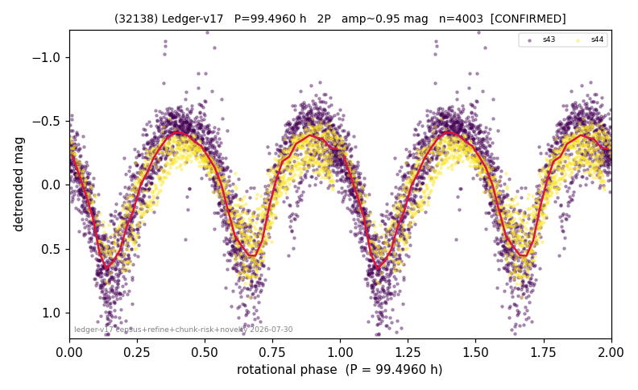

# (32138)

**Adopted:** 99.496 h, 2P, CONFIRMED

<!-- AUTO:START (regenerated from pipeline outputs; do not hand-edit this block) -->
## Evidence (auto)

Detected in 2 sector(s):

| sector | N | baseline (h) | P_phot (h) | power | FAP | cycles | flags |
|--|--|--|--|--|--|--|--|
| s43 | 2744 | 590.2 | 49.3342 | 0.5769 | 0.0e+00 | 6.0 | star-cleaned:1 |
| s44 | 1271 | 235.0 | 50.1621 | 0.7437 | 0.0e+00 | 4.7 | 2P-ambiguous |

- Pipeline refine said: **2P** (folded amp_fourier 1.147); flags: sick-dips-excised:s43(12)
- DIA (de-comb): **NOT RUN for this lot.** No de-comb verdict exists for this object, so momentum-dump contamination has not been excluded by that test here.
- Gates: FAP<1e-3 and power>=0.10 per detecting sector; >=2 sectors agree (harmonic-aware).
- Adopted shape: **2P** (folded-amplitude rule; pipeline agrees).

### Why this row reads the way it does

- 2 sector(s) detecting
- cross-sector fold correlation 0.98
- doubling BY CONVENTION: amplitude rule on folded amp 1.147 mag, not individually audited

<!-- AUTO:END -->
