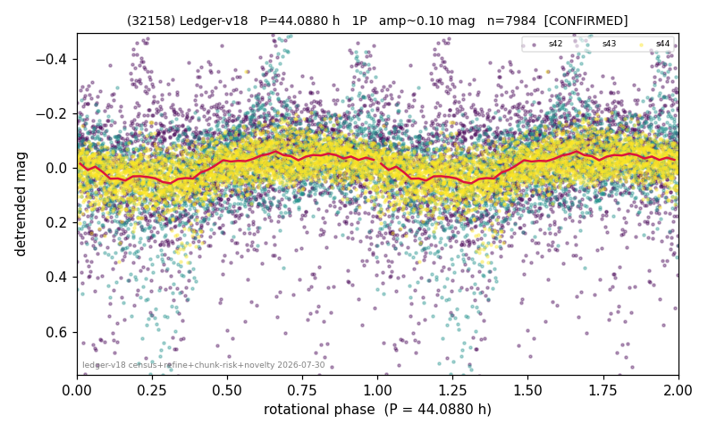

# (32158)

**Adopted:** 44.088 h, 1P, CONFIRMED

<!-- AUTO:START (regenerated from pipeline outputs; do not hand-edit this block) -->
## Evidence (auto)

Detected in 3 sector(s):

| sector | N | baseline (h) | P_phot (h) | power | FAP | cycles | flags |
|--|--|--|--|--|--|--|--|
| s42 | 2774 | 608.6 | 12.3068 | 0.0548 | 7.9e-30 | 49.4 | star-cleaned:5 |
| s43 | 2305 | 548.2 | 43.754 | 0.1151 | 4.9e-57 | 12.5 | star-cleaned:178,2P-ambiguous |
| s44 | 2946 | 574.5 | 44.422 | 0.2514 | 1.8e-180 | 12.9 | 2P-ambiguous |

- Pipeline refine said: **1P** (folded amp_fourier 0.181); flags: sick-dips-excised:s43(8),s44(2)
- DIA (de-comb): survived_v2(ret=0.963[0.95-0.98],s44@44.088h)
- Coverage: **3 sector(s)**, best sector covers **13.8 cycles** of the adopted period. Measured periodogram peak width 6% of the period, i.e. about **+/- 1.091 h** (1 sigma); the decimal places in the adopted value are not a precision claim.
- Factor of two: no doubling was applied.
- Gates: FAP<1e-3 and power>=0.10 per detecting sector; >=2 sectors agree (harmonic-aware).
- Adopted shape: **1P** (folded-amplitude rule; pipeline agrees).

### Why this row reads the way it does

- 2 sector(s) detecting
- cross-sector fold correlation 0.80
- single-peaked at folded amp 0.181 mag

<!-- AUTO:END -->
