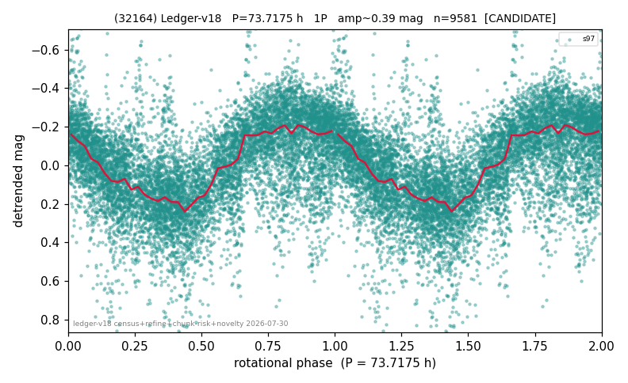

# (32164)

**Adopted:** 73.7175 h, 1P, CANDIDATE

<!-- AUTO:START (regenerated from pipeline outputs; do not hand-edit this block) -->
## Evidence (auto)

Detected in 1 sector(s):

| sector | N | baseline (h) | P_phot (h) | power | FAP | cycles | flags |
|--|--|--|--|--|--|--|--|
| s97 | 9733 | 786.7 | 73.9209 | 0.368 | 0.0e+00 | 5.3 | star-cleaned:72 |

- Pipeline refine said: **1P** (folded amp_fourier 0.383); flags: sick-dips-excised:s97(49);near-threshold:0.38
- DIA (de-comb): survived(dPW=+0%,R2=0.01,s97@73.718h,2sec)
- Coverage: **1 sector(s)**, best sector covers **10.67 cycles** of the adopted period. Measured periodogram peak width 8% of the period, i.e. about **+/- 2.63 h** (1 sigma); the decimal places in the adopted value are not a precision claim.
- Factor of two: no doubling was applied.
- Gates: FAP<1e-3 and power>=0.10 per detecting sector; single strong sector (candidate ceiling).
- Adopted shape: **1P** (folded-amplitude rule; pipeline agrees).

### Why this row reads the way it does

- 1 sector(s) detecting
- single-peaked at folded amp 0.383 mag
- CHUNK QUARANTINE (SUPPRESSED;AMP_DOMINATED): the adopted period is at least half the extraction chunk span, and median-matching the chunks removes variation slower than one chunk; the stitching steps applied between chunks are LARGER than the object's own folded amplitude, so any fold shape may be an artefact. Needs a direct re-extraction before this period can be claimed
- CHUNK QUARANTINE LIFTED by direct re-extraction 2026-08-05: the sector(s) were re-extracted without chunking and the power at the adopted period is retained or improved (s97 power 0.243->0.251). The stitching filter was not creating this period.

<!-- AUTO:END -->
