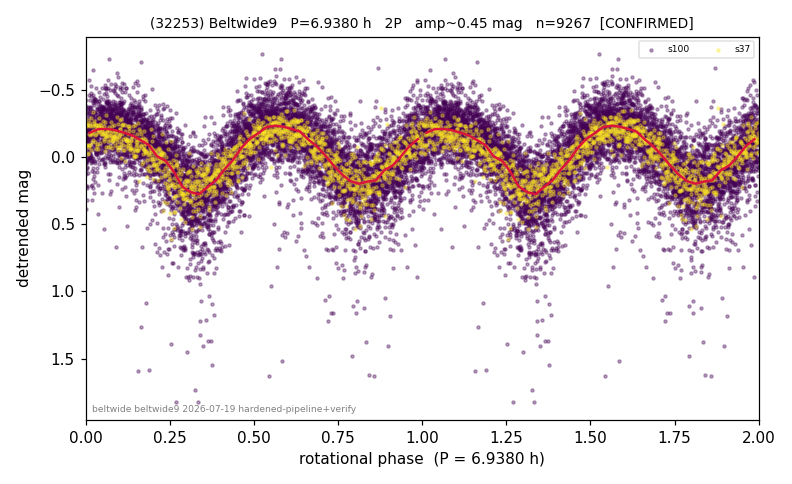

# (32253)

**Adopted:** 6.938 h, 2P, CONFIRMED

<!-- AUTO:START (regenerated from pipeline outputs; do not hand-edit this block) -->
## Evidence (auto)

Detected in 2 sector(s):

| sector | N | baseline (h) | P_phot (h) | power | FAP | cycles | flags |
|--|--|--|--|--|--|--|--|
| s37 | 1249 | 249.2 | 3.4694 | 0.7025 | 0.0e+00 | 71.8 | 2P-ambiguous |
| s100 | 8018 | 559.0 | 3.4693 | 0.4704 | 0.0e+00 | 161.1 | 2P-ambiguous |

- Pipeline refine said: **2P** (folded amp_fourier 0.49); flags: sick-dips-excised:s100(18)
- DIA (de-comb): survived(dPW=+0%,R2=0.02,s37@3.469h,3sec)
- Gates: FAP<1e-3 and power>=0.10 per detecting sector; >=2 sectors agree (harmonic-aware).
- Adopted shape: **2P** (folded-amplitude rule; pipeline agrees).

### Why this row reads the way it does

- folded_amp=0.50. s37+s100 agree 3.4693h to 0.003% (FAP~0 both); folded amp 0.48-0.53>0.40 -> 2P; s100 dips benign (re-LS identical); window clears comb.

<!-- AUTO:END -->
