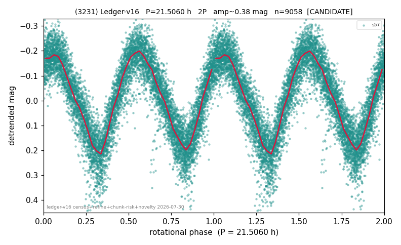

# (3231)

**Adopted:** 21.506 h, 2P, CONFIRMED

<!-- AUTO:START (regenerated from pipeline outputs; do not hand-edit this block) -->
## Evidence (auto)

Detected in 1 sector(s):

| sector | N | baseline (h) | P_phot (h) | power | FAP | cycles | flags |
|--|--|--|--|--|--|--|--|
| s57 | 9066 | 672.9 | 10.753 | 0.7901 | 0.0e+00 | 62.6 | 2P-ambiguous |

- Pipeline refine said: **2P** (folded amp_fourier 0.406); flags: near-comb(amp-cleared):n=15;sick-dips-excised:s57(5);near-threshold:0.41
- DIA (de-comb): survived(dPW=-1%,R2=0.01,s57@10.753h,2sec)
- Coverage: **1 sector(s)**, best sector covers **31.29 cycles** of the adopted period. Measured periodogram peak width 1% of the period, i.e. about **+/- 0.06234 h** (1 sigma); the decimal places in the adopted value are not a precision claim.
- Factor of two: **adopted on the amplitude convention**: standard practice for an elongated body, but a convention rather than a measurement.
- Gates: FAP<1e-3 and power>=0.10 per detecting sector; >=2 sectors agree (harmonic-aware).
- Adopted shape: **2P** (folded-amplitude rule; pipeline agrees).

### Why this row reads the way it does

- 1 sector(s) detecting
- doubling BY CONVENTION: amplitude rule on folded amp 0.406 mag, not individually audited
- PROMOTED CANDIDATE->CONFIRMED 2026-08-15 (TESS+ZTF joint, the user-blessed pathway): independent ZTF blind Lomb-Scargle over 6.7 yr / 170 g+r points recovers 10.7483 h = TESS-P/2 10.7530h to 0.04%, power 0.840, trials-corrected FAP 2.4e-61, beating every alias/comb candidate (alias 7.4259h at 0.792); a ZTF detection cannot be a TESS comb tooth or TESS red noise, so this is a genuine second realization and the single-sector ceiling no longer applies

<!-- AUTO:END -->
