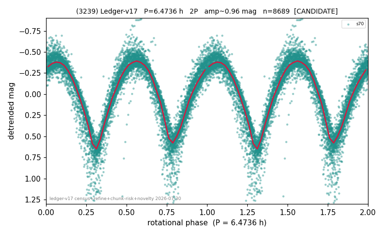

# (3239)

**Adopted:** 6.4736 h, 2P, CANDIDATE

<!-- AUTO:START (regenerated from pipeline outputs; do not hand-edit this block) -->
## Evidence (auto)

Detected in 1 sector(s):

| sector | N | baseline (h) | P_phot (h) | power | FAP | cycles | flags |
|--|--|--|--|--|--|--|--|
| s70 | 8724 | 601.0 | 3.2368 | 0.8574 | 0.0e+00 | 185.7 | 2P-ambiguous |

- Pipeline refine said: **2P** (folded amp_fourier 1.002); flags: sick-dips-excised:s70(35)
- DIA (de-comb): survived(dPW=+3%,R2=0.37,s70@3.237h,2sec)
- Coverage: **1 sector(s)**, best sector covers **92.84 cycles** of the adopted period. Measured periodogram peak width 0% of the period, i.e. about **+/- 0.01 h** (1 sigma); the decimal places in the adopted value are not a precision claim.
- Factor of two: **adopted on the amplitude convention**: standard practice for an elongated body, but a convention rather than a measurement.
- Gates: FAP<1e-3 and power>=0.10 per detecting sector; single strong sector (candidate ceiling).
- Adopted shape: **2P** (folded-amplitude rule; pipeline agrees).

### Why this row reads the way it does

- 1 sector(s) detecting
- doubling BY CONVENTION: amplitude rule on folded amp 1.002 mag, not individually audited

<!-- AUTO:END -->
