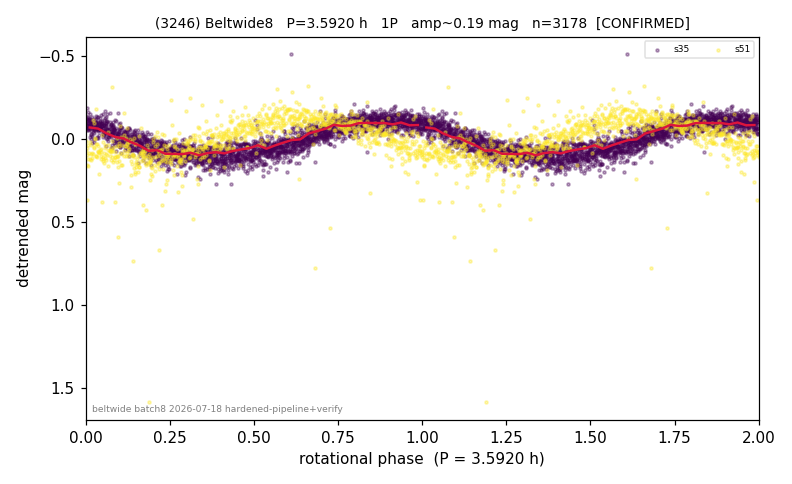

# (3246)

**Adopted:** 3.592 h, 1P, CONFIRMED

<!-- AUTO:START (regenerated from pipeline outputs; do not hand-edit this block) -->
## Evidence (auto)

Detected in 2 sector(s):

| sector | N | baseline (h) | P_phot (h) | power | FAP | cycles | flags |
|--|--|--|--|--|--|--|--|
| s35 | 2276 | 589.5 | 3.5919 | 0.7809 | 0.0e+00 | 164.1 | star-cleaned:3,2P-ambiguous |
| s51 | 902 | 384.8 | 3.5922 | 0.6359 | 5.0e-193 | 107.1 | star-cleaned:5,2P-ambiguous |

- Refined shape: **1P** (folded amp_fourier 0.271); flags: sick-dips-excised:s51(2)
- DIA (de-comb): survived(dPW=+1%,R2=0.35,s35@3.592h,2sec)
- Gates: FAP<1e-3 and power>=0.10 per detecting sector; >=2 sectors agree (harmonic-aware); folded-amplitude rule -> 1P.

<!-- AUTO:END -->
