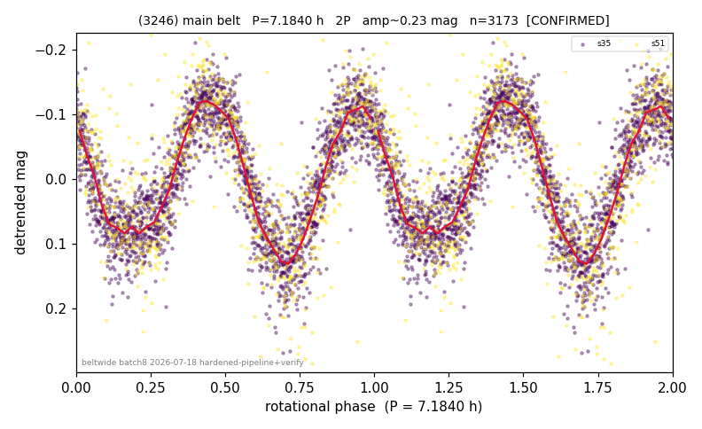

# (3246)

**Adopted:** 7.184 h, 2P, CONFIRMED

<!-- AUTO:START (regenerated from pipeline outputs; do not hand-edit this block) -->
## Evidence (auto)

Detected in 2 sector(s):

| sector | N | baseline (h) | P_phot (h) | power | FAP | cycles | flags |
|--|--|--|--|--|--|--|--|
| s35 | 2276 | 589.5 | 3.5919 | 0.7809 | 0.0e+00 | 164.1 | star-cleaned:3,2P-ambiguous |
| s51 | 902 | 384.8 | 3.5922 | 0.6359 | 5.0e-193 | 107.1 | star-cleaned:5,2P-ambiguous |

- Pipeline refine said: **1P** (folded amp_fourier 0.271); flags: sick-dips-excised:s51(2)
- DIA (de-comb): survived(dPW=+1%,R2=0.35,s35@3.592h,2sec)
- Gates: FAP<1e-3 and power>=0.10 per detecting sector; >=2 sectors agree (harmonic-aware).
- **Adopted shape 2P OVERRIDES the pipeline's 1P** (doubling audit 2026-07-25: folded amplitude >= 0.25 mag, so a single-peaked curve is physically implausible; Harris convention -> 2P. The census 3-test doubling logic was measured at only 30% recall against 289 LCDB U>=2 ground-truth periods).

### Why this row reads the way it does

- folded_amp=0.19. s35 (P=3.5919h, power=0.78, FAP~0) and s51 (P=3.5922h, power=0.64, FAP~1e-193) independently agree to 0.01%, comfortably above CONFIRMED thresholds; folded phase-binned ridge amp ~0.19-0.23 mag (well under 0.40) with a s; P doubled 2026-07-25 (doubling audit: amp>=0.25 + Harris convention)

<!-- AUTO:END -->
