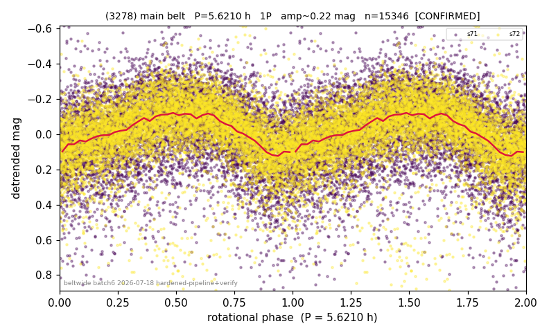

# (3278)

**Adopted:** 5.621 h, 1P, CONFIRMED

<!-- AUTO:START (regenerated from pipeline outputs; do not hand-edit this block) -->
## Evidence (auto)

Detected in 2 sector(s):

| sector | N | baseline (h) | P_phot (h) | power | FAP | cycles | flags |
|--|--|--|--|--|--|--|--|
| s71 | 7466 | 575.8 | 5.622 | 0.137 | 8.0e-234 | 102.4 | star-cleaned:271,2P-ambiguous |
| s72 | 7931 | 583.9 | 5.6198 | 0.2222 | 0.0e+00 | 103.9 | star-cleaned:152,2P-ambiguous |

- Refined shape: **1P** (folded amp_fourier 0.245); flags: sector-dropped:s72(range>3mag);sick-dips-excised:s71(25)
- DIA (de-comb): survived(dPW=+2%,R2=0.11,s71@5.621h,4sec)
- Gates: FAP<1e-3 and power>=0.10 per detecting sector; >=2 sectors agree (harmonic-aware); folded-amplitude rule -> 1P.

<!-- AUTO:END -->
