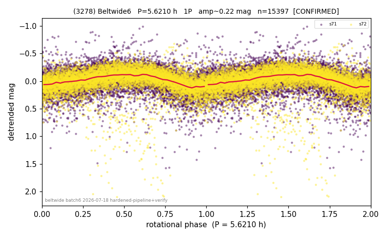

# (3278)

**Adopted:** 11.242 h, 2P, CONFIRMED

<!-- AUTO:START (regenerated from pipeline outputs; do not hand-edit this block) -->
## Evidence (auto)

Detected in 2 sector(s):

| sector | N | baseline (h) | P_phot (h) | power | FAP | cycles | flags |
|--|--|--|--|--|--|--|--|
| s71 | 7466 | 575.8 | 5.622 | 0.137 | 8.0e-234 | 102.4 | star-cleaned:271,2P-ambiguous |
| s72 | 7931 | 583.9 | 5.6198 | 0.2222 | 0.0e+00 | 103.9 | star-cleaned:152,2P-ambiguous |

- Pipeline refine said: **1P** (folded amp_fourier 0.245); flags: sick-dips-excised:s71(25),s72(25)
- DIA (de-comb): survived_v2(ret=1.001[1.00-1.01],s71@5.621h)
- Coverage: **2 sector(s)**, best sector covers **103.88 cycles** of the adopted period. Measured periodogram peak width 1% of the period, i.e. about **+/- 0.02005 h** (1 sigma); the decimal places in the adopted value are not a precision claim.
- Factor of two: no doubling was applied.
- Gates: FAP<1e-3 and power>=0.10 per detecting sector; >=2 sectors agree (harmonic-aware).
- **Adopted shape 2P OVERRIDES the pipeline's 1P** (doubling audit 2026-07-25: folded amplitude >= 0.25 mag, so a single-peaked curve is physically implausible; Harris convention -> 2P. The census 3-test doubling logic was measured at only 30% recall against 289 LCDB U>=2 ground-truth periods).

### Why this row reads the way it does

- REVIEW-FLAG: folded_amp=0.24. Both sectors independently detect P=5.621h at extreme significance (s71: pw=0.137, FAP=8e-234; s72: pw=0.222, FAP≈0), agreeing to 0.04%, with folded (phase-binned) curves cross-correlating at r=0.94 and matchin
- DOUBLING CORRECTED 2026-08-30: adopted period doubled from 5.621 h. The previous value came from the folded-amplitude rule, which was found biased low (9 of 9 disagreements with MPB 2024-2026 in the same direction). Odd-harmonic test at the long period gives z1=4.04 with margin 2.1 over non-harmonic multiples 1.7x/2.3x (reference group: 0 of 38 above margin 2).

<!-- AUTO:END -->
