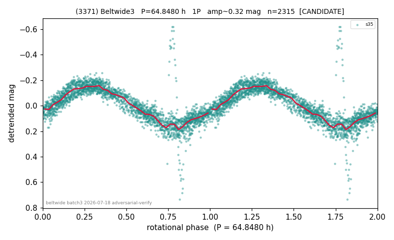

# (3371)

**Adopted:** 64.848 h, 1P, CANDIDATE

<!-- AUTO:START (regenerated from pipeline outputs; do not hand-edit this block) -->
## Evidence (auto)

Detected in 1 sector(s):

| sector | N | baseline (h) | P_phot (h) | power | FAP | cycles | flags |
|--|--|--|--|--|--|--|--|
| s35 | 2318 | 588.5 | 64.8451 | 0.7193 | 0.0e+00 | 9.1 | 2P-ambiguous |

- Pipeline refine said: **1P** (folded amp_fourier 0.306); flags: near-comb(amp-cleared):n=5;gap-alias-risk:120h;sick-dips-excised:s35(3)
- DIA (de-comb): survived(dPW=+12%,R2=0.36,s35@64.845h,1sec)
- Coverage: **1 sector(s)**, best sector covers **9.08 cycles** of the adopted period. Measured periodogram peak width 9% of the period, i.e. about **+/- 2.487 h** (1 sigma); the decimal places in the adopted value are not a precision claim.
- Factor of two: no doubling was applied.
- Gates: FAP<1e-3 and power>=0.10 per detecting sector; single strong sector (candidate ceiling).
- Adopted shape: **1P** (folded-amplitude rule; pipeline agrees).

### Why this row reads the way it does

- single-sector s35; comb-adjacent

<!-- AUTO:END -->
