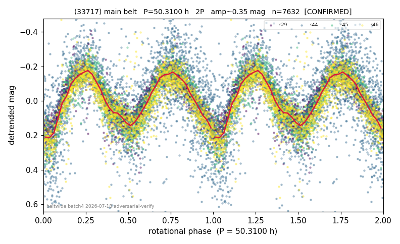

# (33717)

**Adopted:** 50.31 h, 2P, CONFIRMED

<!-- AUTO:START (regenerated from pipeline outputs; do not hand-edit this block) -->
## Evidence (auto)

Detected in 4 sector(s):

| sector | N | baseline (h) | P_phot (h) | power | FAP | cycles | flags |
|--|--|--|--|--|--|--|--|
| s29 | 2023 | 468.8 | 25.1435 | 0.8093 | 0.0e+00 | 18.6 | star-cleaned:20,2P-ambiguous |
| s44 | 2400 | 580.6 | 25.1703 | 0.3453 | 5.4e-216 | 23.1 | 2P-ambiguous |
| s45 | 1185 | 226.3 | 25.2022 | 0.7502 | 0.0e+00 | 9.0 | 2P-ambiguous |
| s46 | 2034 | 444.7 | 25.0901 | 0.6497 | 0.0e+00 | 17.7 | star-cleaned:26,2P-ambiguous |

- Refined shape: **2P** (folded amp_fourier 0.401); flags: near-comb(amp-cleared):n=13;gap-alias-risk:76h;sick-dips-excised:s29(4),s44(1),s46(2);near
- DIA (de-comb): survived(dPW=+3%,R2=0.16,s45@25.157h,6sec)
- Gates: FAP<1e-3 and power>=0.10 per detecting sector; >=2 sectors agree (harmonic-aware); folded-amplitude rule -> 2P.

<!-- AUTO:END -->
