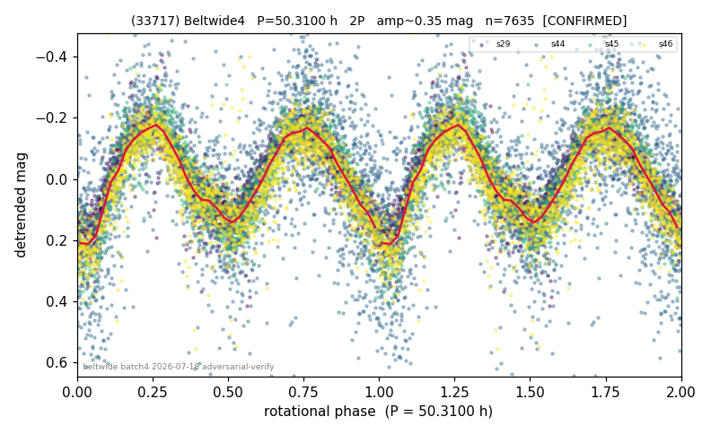

# (33717)

**Adopted:** 50.31 h, 2P, CONFIRMED

<!-- AUTO:START (regenerated from pipeline outputs; do not hand-edit this block) -->
## Evidence (auto)

Detected in 4 sector(s):

| sector | N | baseline (h) | P_phot (h) | power | FAP | cycles | flags |
|--|--|--|--|--|--|--|--|
| s29 | 2023 | 468.8 | 25.1435 | 0.8093 | 0.0e+00 | 18.6 | star-cleaned:20,2P-ambiguous |
| s44 | 2400 | 580.6 | 25.1703 | 0.3453 | 5.4e-216 | 23.1 | 2P-ambiguous |
| s45 | 1185 | 226.3 | 25.2022 | 0.7502 | 0.0e+00 | 9.0 | 2P-ambiguous |
| s46 | 2034 | 444.7 | 25.0901 | 0.6497 | 0.0e+00 | 17.7 | star-cleaned:26,2P-ambiguous |

- Pipeline refine said: **1P** (folded amp_fourier 0.383); flags: amp-from-clean-sectors(ignored s44);near-comb(amp-cleared):n=13;sick-dips-excised:s29(4),s
- DIA (de-comb): survived(dPW=+3%,R2=0.16,s45@25.157h,6sec)
- Coverage: **4 sector(s)**, best sector covers **11.54 cycles** of the adopted period. Measured periodogram peak width 4% of the period, i.e. about **+/- 0.3758 h** (1 sigma); the decimal places in the adopted value are not a precision claim.
- Factor of two: **adopted on the amplitude convention**: standard practice for an elongated body, but a convention rather than a measurement.
- Gates: FAP<1e-3 and power>=0.10 per detecting sector; >=2 sectors agree (harmonic-aware).
- **Adopted shape 2P OVERRIDES the pipeline's 1P** (doubling audit 2026-07-25: folded amplitude >= 0.25 mag, so a single-peaked curve is physically implausible; Harris convention -> 2P. The census 3-test doubling logic was measured at only 30% recall against 289 LCDB U>=2 ground-truth periods).

### Why this row reads the way it does

- Independent error-weighted LS and PDM in all 4 sectors (S29,S44,S45,S46) recover the same fundamental period, 25.09-25.20h, with FAP~0 and LS power 0.
- 2P by amplitude rule (folded_amp=0.383)

<!-- AUTO:END -->
