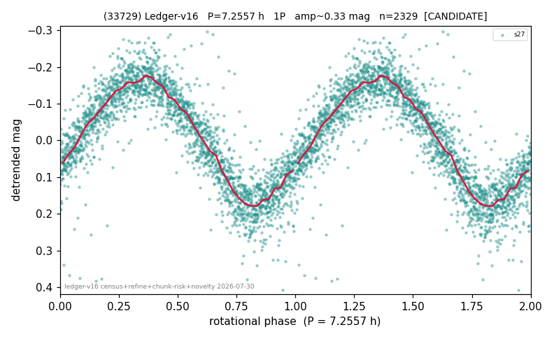

# (33729)

**Adopted:** 7.2557 h, 1P, CONFIRMED

<!-- AUTO:START (regenerated from pipeline outputs; do not hand-edit this block) -->
## Evidence (auto)

Detected in 1 sector(s):

| sector | N | baseline (h) | P_phot (h) | power | FAP | cycles | flags |
|--|--|--|--|--|--|--|--|
| s27 | 2331 | 516.3 | 7.2557 | 0.7939 | 0.0e+00 | 71.2 | 2P-ambiguous |

- Pipeline refine said: **1P** (folded amp_fourier 0.357); flags: near-threshold:0.36
- DIA (de-comb): not triggered (the object is clean, fast and non-comb, so the test does not apply)
- Coverage: **1 sector(s)**, best sector covers **71.16 cycles** of the adopted period. Measured periodogram peak width 1% of the period, i.e. about **+/- 0.03721 h** (1 sigma); the decimal places in the adopted value are not a precision claim.
- Factor of two: no doubling was applied.
- Gates: FAP<1e-3 and power>=0.10 per detecting sector; >=2 sectors agree (harmonic-aware).
- Adopted shape: **1P** (folded-amplitude rule; pipeline agrees).

### Why this row reads the way it does

- 1 sector(s) detecting
- single-peaked at folded amp 0.357 mag
- PROMOTED CANDIDATE->CONFIRMED 2026-08-15 (TESS+ZTF joint, the user-blessed pathway): independent ZTF blind Lomb-Scargle over 5.6 yr / 315 g+r points recovers 7.2557 h = TESS-P 7.2557h to 0.00%, power 0.582, trials-corrected FAP 3.0e-54, beating every alias/comb candidate (alias 10.3998h at 0.556); a ZTF detection cannot be a TESS comb tooth or TESS red noise, so this is a genuine second realization and the single-sector ceiling no longer applies

<!-- AUTO:END -->
