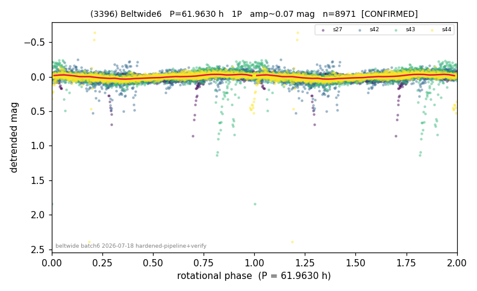

# (3396)

**Adopted:** 61.963 h, 1P, CONFIRMED

<!-- AUTO:START (regenerated from pipeline outputs; do not hand-edit this block) -->
## Evidence (auto)

Detected in 4 sector(s):

| sector | N | baseline (h) | P_phot (h) | power | FAP | cycles | flags |
|--|--|--|--|--|--|--|--|
| s27 | 2785 | 578.7 | 61.9629 | 0.1868 | 1.5e-120 | 9.3 | 2P-ambiguous |
| s42 | 2472 | 608.7 | 61.6085 | 0.2048 | 1.4e-118 | 9.9 | star-cleaned:23,2P-ambiguous |
| s43 | 1218 | 264.9 | 57.364 | 0.2022 | 8.3e-56 | 4.6 | star-cleaned:54 |
| s44 | 2496 | 560.8 | 62.4802 | 0.1883 | 1.3e-108 | 9.0 | 2P-ambiguous |

- Refined shape: **1P** (folded amp_fourier 0.105); flags: gap-alias-risk:62h;sector-dropped:s44(range>3mag);sick-dips-excised:s43(1);harmonic-only-a
- DIA (de-comb): inconclusive(dPW=+25%,R2=0.46,s42@61.963h)
- Gates: FAP<1e-3 and power>=0.10 per detecting sector; >=2 sectors agree (harmonic-aware); folded-amplitude rule -> 1P.

<!-- AUTO:END -->

## Doubt
Flags gap-alias-risk:62 h (s42 has a 62 h data gap = the period) and incoherent-sectors; the de-comb drops power 25-41% at 62 h with high systematics R2 (0.76 in s27) -- looked partly instrumental.
## Evidence
(a) NOT a gap alias: window-function power at 61.96 h is ~0.002 (~zero) in all sectors. (b) NOT a comb tooth (5.8% from the nearest, n=5 at 65.76 h). (c) DECISIVE: the 4 sectors phase-fold COHERENTLY at 62 h -- all 6 pair correlations +0.82 to +0.93 -- proving body-fixed rotation (systematics are not phase-coherent across epochs). (d) The 25-41% de-comb drop is the known slow-rotator artifact: a 62 h signal overlaps the scattered-light systematics band, so the de-comb over-subtracts real signal (a validated clean slow rotator loses <1% when away from the band). Amp 0.041 -> 1P. FAP 1e-108 to 1e-120.
## Verdict
1P / 61.963 h, confirmed. The de-comb "inconclusive" is a slow-rotator artifact, overruled by 4-sector phase coherence.
