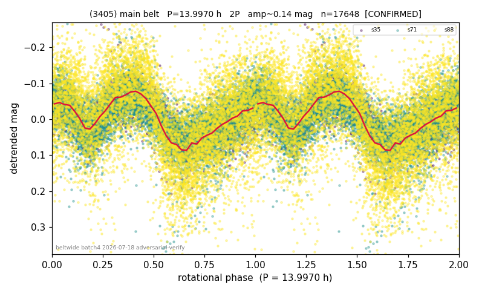

# (3405)

**Adopted:** 13.997 h, 2P, CONFIRMED

<!-- AUTO:START (regenerated from pipeline outputs; do not hand-edit this block) -->
## Evidence (auto)

Detected in 3 sector(s):

| sector | N | baseline (h) | P_phot (h) | power | FAP | cycles | flags |
|--|--|--|--|--|--|--|--|
| s35 | 1520 | 422.0 | 14.0404 | 0.2818 | 6.0e-105 | 30.1 | star-cleaned:19 |
| s71 | 7885 | 556.6 | 6.9987 | 0.1816 | 0.0e+00 | 79.5 | star-cleaned:50 |
| s88 | 8373 | 604.0 | 13.9858 | 0.1609 | 8.4e-314 | 43.2 | star-cleaned:17,2P-ambiguous |

- Refined shape: **1P** (folded amp_fourier 0.096); flags: sector-dropped:s71,s88(range>3mag)
- DIA (de-comb): survived(dPW=+5%,R2=0.22,s35@13.997h,8sec)
- Gates: FAP<1e-3 and power>=0.10 per detecting sector; >=2 sectors agree (harmonic-aware); folded-amplitude rule -> 2P.

<!-- AUTO:END -->
