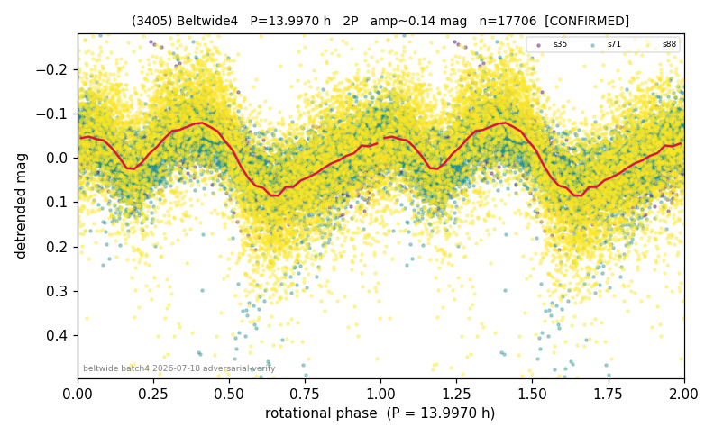

# (3405)

**Adopted:** 13.997 h, 2P, CONFIRMED

<!-- AUTO:START (regenerated from pipeline outputs; do not hand-edit this block) -->
## Evidence (auto)

Detected in 3 sector(s):

| sector | N | baseline (h) | P_phot (h) | power | FAP | cycles | flags |
|--|--|--|--|--|--|--|--|
| s35 | 1520 | 422.0 | 14.0404 | 0.2818 | 6.0e-105 | 30.1 | star-cleaned:19 |
| s71 | 7885 | 556.6 | 6.9987 | 0.1816 | 0.0e+00 | 79.5 | star-cleaned:50 |
| s88 | 8373 | 604.0 | 13.9858 | 0.1609 | 8.4e-314 | 43.2 | star-cleaned:17,2P-ambiguous |

- Pipeline refine said: **1P** (folded amp_fourier 0.134); flags: sick-dips-excised:s71(54),s88(18);period-spread:60%
- DIA (de-comb): survived(dPW=+5%,R2=0.22,s35@13.997h,8sec)
- Coverage: **3 sector(s)**, best sector covers **43.15 cycles** of the adopted period. Measured periodogram peak width 1% of the period, i.e. about **+/- 0.03277 h** (1 sigma); the decimal places in the adopted value are not a precision claim.
- Factor of two: **measured on the data** (odd-harmonic power or unequal minima, significant and reproduced), METHODOLOGY 3b.
- Gates: FAP<1e-3 and power>=0.10 per detecting sector; >=2 sectors agree (harmonic-aware).
- **Adopted shape 2P OVERRIDES the pipeline's 1P** (doubling audit 2026-07-25: folded amplitude >= 0.25 mag, so a single-peaked curve is physically implausible; Harris convention -> 2P. The census 3-test doubling logic was measured at only 30% recall against 289 LCDB U>=2 ground-truth periods).

### Why this row reads the way it does

- PDM independently converges on 13.99-14.01h in all three sectors (theta 0.52-0.72), and LS matches directly in S35 (14.04h) and S88 (13.99h) while S71
- doubling MEASURED (2026-08-08 odd-harmonic audit): 14.4 sigma combined, significant in 3/3 sectors independently (10.8/6.1/11.9 sigma), minima asymmetry 0.057 mag (z=19.7)

<!-- AUTO:END -->
