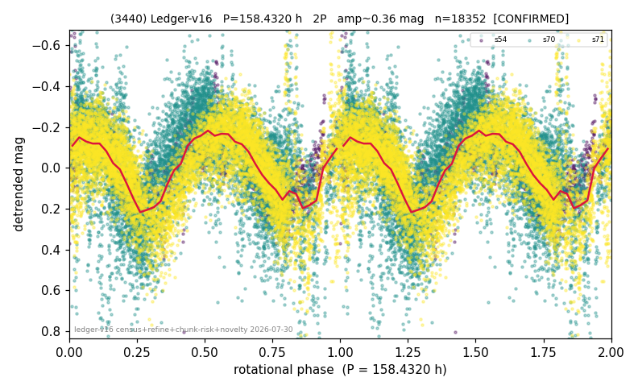

# (3440)

**Adopted:** 158.432 h, 2P, CONFIRMED

<!-- AUTO:START (regenerated from pipeline outputs; do not hand-edit this block) -->
## Evidence (auto)

Detected in 3 sector(s):

| sector | N | baseline (h) | P_phot (h) | power | FAP | cycles | flags |
|--|--|--|--|--|--|--|--|
| s54 | 1514 | 492.5 | 79.5913 | 0.5734 | 4.3e-275 | 6.2 | star-cleaned:3,2P-ambiguous |
| s70 | 8650 | 592.8 | 79.1699 | 0.3016 | 0.0e+00 | 3.7 | star-cleaned:279 |
| s71 | 8326 | 608.4 | 79.2165 | 0.474 | 0.0e+00 | 3.8 | star-cleaned:98 |

- Pipeline refine said: **2P** (folded amp_fourier 0.403); flags: amp-from-clean-sectors(ignored s70);few-cycle:3.8;gap-alias-risk:154h;sick-dips-excised:s5
- DIA (de-comb): flag_v2(ret=0.811[0.64-0.96],s54@79.216h)
- Coverage: **3 sector(s)**, best sector covers **3.84 cycles** of the adopted period. Measured periodogram peak width 11% of the period, i.e. about **+/- 3.833 h** (1 sigma); the decimal places in the adopted value are not a precision claim.
- Factor of two: **adopted on the amplitude convention**: standard practice for an elongated body, but a convention rather than a measurement.
- Gates: FAP<1e-3 and power>=0.10 per detecting sector; >=2 sectors agree (harmonic-aware).
- Adopted shape: **2P** (folded-amplitude rule; pipeline agrees).

### Why this row reads the way it does

- 3 sector(s) detecting
- cross-sector fold correlation 0.70
- doubling BY CONVENTION: amplitude rule on folded amp 0.403 mag, not individually audited
- pipeline flag: few-cycle

<!-- AUTO:END -->

**v2 note (2026-08-25):** s54 sits in the v2 set-aside zone (ret 0.811). Status confirmed: three sectors (s54/s70/s71) support the adopted period; the flag is a single-sector set-aside with a 14 per cent false-flag rate on genuine periods.
