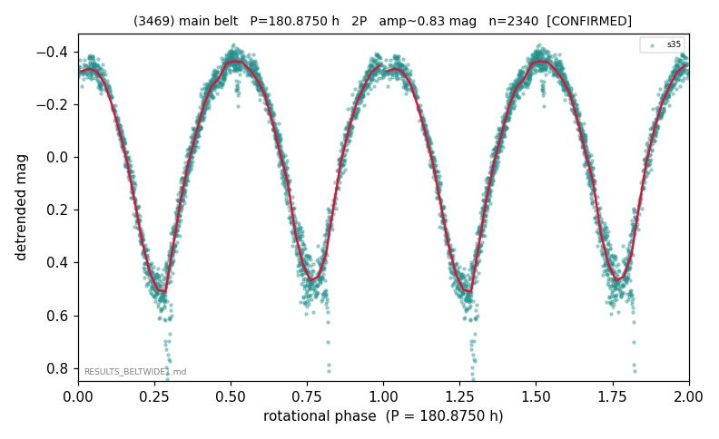

# (3469)

**Adopted:** 180.875 h, 2P, CONFIRMED

<!-- AUTO:START (regenerated from pipeline outputs; do not hand-edit this block) -->
## Evidence (auto)

Detected in 1 sector(s):

| sector | N | baseline (h) | P_phot (h) | power | FAP | cycles | flags |
|--|--|--|--|--|--|--|--|
| s35 | 2340 | 586.5 | 90.4374 | 0.9195 | 0.0e+00 | 6.5 | 2P-ambiguous |

- Refined shape: **2P** (folded amp_fourier 0.86); flags: few-cycle:3.2;gap-alias-risk:117h
- DIA (de-comb): survived(dPW=+13%,R2=0.21,s35@90.437h,2sec)
- Gates: FAP<1e-3 and power>=0.10 per detecting sector; >=2 sectors agree (harmonic-aware); folded-amplitude rule -> 2P.

<!-- AUTO:END -->
