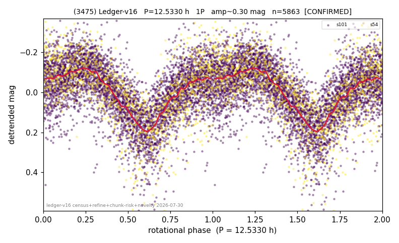

# (3475)

**Adopted:** 25.066 h, 2P, CONFIRMED

<!-- AUTO:START (regenerated from pipeline outputs; do not hand-edit this block) -->
## Evidence (auto)

Detected in 2 sector(s):

| sector | N | baseline (h) | P_phot (h) | power | FAP | cycles | flags |
|--|--|--|--|--|--|--|--|
| s54 | 1215 | 370.0 | 12.5254 | 0.3797 | 1.3e-121 | 14.8 | star-cleaned:20 |
| s101 | 4695 | 322.9 | 12.5406 | 0.3417 | 0.0e+00 | 12.9 | clean |

- Pipeline refine said: **1P** (folded amp_fourier 0.36); flags: sick-dips-excised:s101(10),s54(7);near-threshold:0.36
- DIA (de-comb): survived_v2(ret=1.000[0.99-1.01],s54@12.533h)
- Coverage: **2 sector(s)**, best sector covers **29.52 cycles** of the adopted period. Measured periodogram peak width 3% of the period, i.e. about **+/- 0.1761 h** (1 sigma); the decimal places in the adopted value are not a precision claim.
- Factor of two: no doubling was applied.
- Gates: FAP<1e-3 and power>=0.10 per detecting sector; >=2 sectors agree (harmonic-aware).
- **Adopted shape 2P OVERRIDES the pipeline's 1P** (doubling audit 2026-07-25: folded amplitude >= 0.25 mag, so a single-peaked curve is physically implausible; Harris convention -> 2P. The census 3-test doubling logic was measured at only 30% recall against 289 LCDB U>=2 ground-truth periods).

### Why this row reads the way it does

- 2 sector(s) detecting
- cross-sector fold correlation 0.96
- single-peaked at folded amp 0.360 mag
- DOUBLING CORRECTED 2026-08-30: adopted period doubled from 12.533 h. The previous value came from the folded-amplitude rule, which was found biased low (9 of 9 disagreements with MPB 2024-2026 in the same direction). Odd-harmonic test at the long period gives z1=6.19 with margin 3.13 over non-harmonic multiples 1.7x/2.3x (reference group: 0 of 38 above margin 2).

<!-- AUTO:END -->
