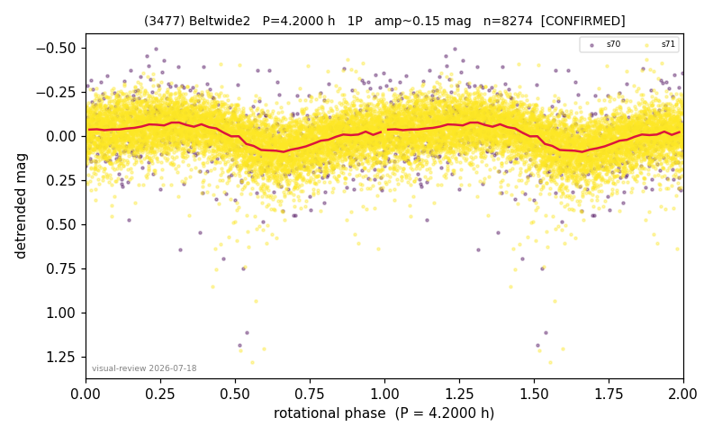

# (3477)

**Adopted:** 4.2 h, 1P, CONFIRMED

<!-- AUTO:START (regenerated from pipeline outputs; do not hand-edit this block) -->
## Evidence (auto)

Detected in 2 sector(s):

| sector | N | baseline (h) | P_phot (h) | power | FAP | cycles | flags |
|--|--|--|--|--|--|--|--|
| s70 | 542 | 32.1 | 4.092 | 0.1032 | 1.2e-09 | 7.8 | 2P-ambiguous |
| s71 | 7732 | 559.7 | 4.2 | 0.1689 | 2.3e-305 | 133.3 | star-cleaned:5,2P-ambiguous |

- Refined shape: **1P** (folded amp_fourier 0.206); flags: sick-dips-excised:s70(2),s71(5);harmonic-only-agreement:s70(pw=0.10),s71(pw=0.00)
- DIA (de-comb): inconclusive(dPW=+31%,R2=0.24,s70@4.146h)
- Gates: FAP<1e-3 and power>=0.10 per detecting sector; >=2 sectors agree (harmonic-aware); folded-amplitude rule -> 1P.

<!-- AUTO:END -->
