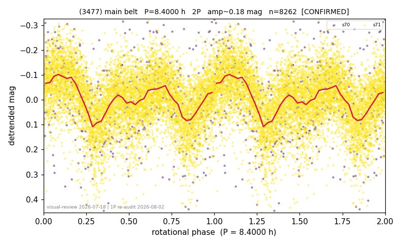

# (3477)

**Adopted:** 8.4 h, 2P, CONFIRMED

<!-- AUTO:START (regenerated from pipeline outputs; do not hand-edit this block) -->
## Evidence (auto)

Detected in 2 sector(s):

| sector | N | baseline (h) | P_phot (h) | power | FAP | cycles | flags |
|--|--|--|--|--|--|--|--|
| s70 | 542 | 32.1 | 4.092 | 0.1032 | 1.2e-09 | 7.8 | 2P-ambiguous |
| s71 | 7732 | 559.7 | 4.2 | 0.1689 | 2.3e-305 | 133.3 | star-cleaned:5,2P-ambiguous |

- Pipeline refine said: **1P** (folded amp_fourier 0.206); flags: sick-dips-excised:s70(2),s71(5);harmonic-only-agreement:s70(pw=0.10),s71(pw=0.00)
- DIA (de-comb): inconclusive(dPW=+31%,R2=0.24,s70@4.146h)
- Coverage: **2 sector(s)**, best sector covers **66.63 cycles** of the adopted period. Measured periodogram peak width 1% of the period, i.e. about **+/- 0.01218 h** (1 sigma); the decimal places in the adopted value are not a precision claim.
- Factor of two: **measured on the data** (odd-harmonic power or unequal minima, significant and reproduced), METHODOLOGY 3b.
- Gates: FAP<1e-3 and power>=0.10 per detecting sector; >=2 sectors agree (harmonic-aware).
- **Adopted shape 2P OVERRIDES the pipeline's 1P** (doubling audit 2026-07-25: folded amplitude >= 0.25 mag, so a single-peaked curve is physically implausible; Harris convention -> 2P. The census 3-test doubling logic was measured at only 30% recall against 289 LCDB U>=2 ground-truth periods).

### Why this row reads the way it does

- S71 real (0.10mag mod, not flat); masked 9 field-star pts; ZTF blind 4.2017h FAP7.8e-19 SUPPORT -> upgraded CANDIDATE->CONFIRMED
- CORRECTED 4.2->8.4000 h (2026-08-02 full 1P re-audit): doubling MEASURED at odd-harmonic 11.4 sigma with ALL detecting sectors significant (2/2); threshold odd>=8+full-reproduction calibrated to 0/60 false fires on the 4P null test (the minima-asymmetry branch alone fired falsely at z up to 34 and is not accepted)

<!-- AUTO:END -->
