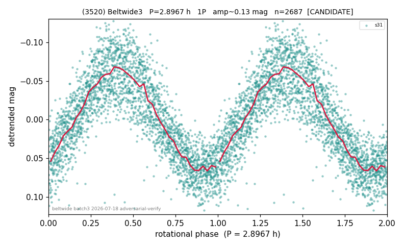

# (3520)

**Adopted:** 2.8967 h, 1P, CANDIDATE

<!-- AUTO:START (regenerated from pipeline outputs; do not hand-edit this block) -->
## Evidence (auto)

Detected in 1 sector(s):

| sector | N | baseline (h) | P_phot (h) | power | FAP | cycles | flags |
|--|--|--|--|--|--|--|--|
| s31 | 2687 | 610.2 | 2.8965 | 0.7218 | 0.0e+00 | 210.7 | 2P-ambiguous |

- Pipeline refine said: **1P** (folded amp_fourier 0.151); flags: clean
- DIA (de-comb): not triggered (clean, fast, non-comb)
- Gates: FAP<1e-3 and power>=0.10 per detecting sector; single strong sector (candidate ceiling).
- Adopted shape: **1P** (folded-amplitude rule; pipeline agrees).

### Why this row reads the way it does

- single-sector s31

<!-- AUTO:END -->
