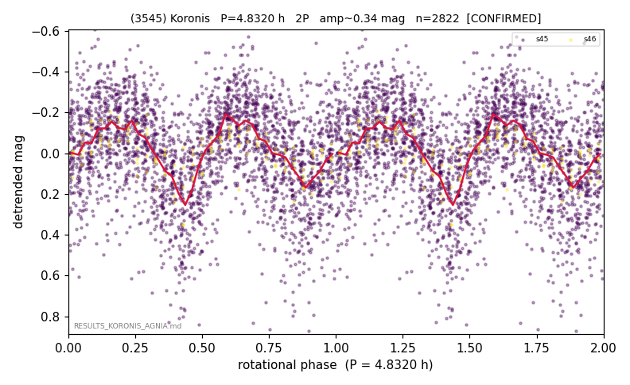

# (3545)

**Adopted:** 4.832 h, 2P, CONFIRMED

<!-- AUTO:START (regenerated from pipeline outputs; do not hand-edit this block) -->
## Evidence (auto)

Detected in 2 sector(s):

| sector | N | baseline (h) | P_phot (h) | power | FAP | cycles | flags |
|--|--|--|--|--|--|--|--|
| s45 | 2685 | 553.2 | 2.4147 | 0.1777 | 1.5e-109 | 229.1 | star-cleaned:38,2P-ambiguous |
| s46 | 143 | 23.7 | 2.4182 | 0.4718 | 1.1e-16 | 9.8 | 2P-ambiguous |

- Pipeline refine said: **1P** (folded amp_fourier 0.213); flags: amp-from-clean-sectors(ignored s45);sick-dips-excised:s45(4)
- DIA (de-comb): inconclusive(dPW=+18%,R2=0.11,s46@2.416h)
- Coverage: **1 sector(s)**, best sector covers **114.49 cycles** of the adopted period. Measured periodogram peak width 0% of the period, i.e. about **+/- 0.00431 h** (1 sigma); the decimal places in the adopted value are not a precision claim.
- Factor of two: **adopted on the amplitude convention**: standard practice for an elongated body, but a convention rather than a measurement.
- Gates: FAP<1e-3 and power>=0.10 per detecting sector; >=2 sectors agree (harmonic-aware).
- **Adopted shape 2P OVERRIDES the pipeline's 1P** (doubling audit 2026-07-25: folded amplitude >= 0.25 mag, so a single-peaked curve is physically implausible; Harris convention -> 2P. The census 3-test doubling logic was measured at only 30% recall against 289 LCDB U>=2 ground-truth periods).

### Why this row reads the way it does

- above barrier; P doubled 2026-07-25 (doubling audit: amp>=0.25 + Harris convention)

<!-- AUTO:END -->
