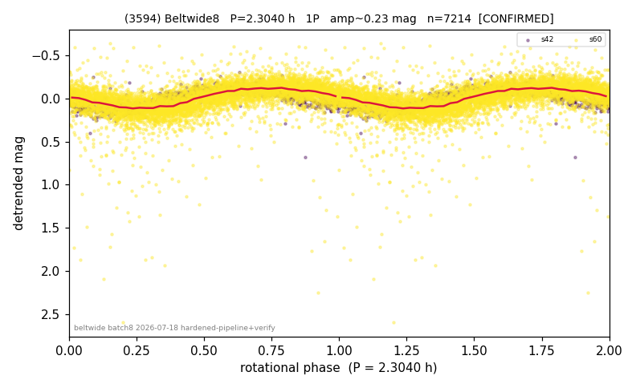

# (3594)

**Adopted:** 2.304 h, 1P, CONFIRMED

<!-- AUTO:START (regenerated from pipeline outputs; do not hand-edit this block) -->
## Evidence (auto)

Detected in 2 sector(s):

| sector | N | baseline (h) | P_phot (h) | power | FAP | cycles | flags |
|--|--|--|--|--|--|--|--|
| s42 | 721 | 185.8 | 2.3037 | 0.7394 | 9.1e-206 | 80.7 | star-cleaned:3,2P-ambiguous |
| s60 | 6493 | 611.5 | 2.3038 | 0.4026 | 0.0e+00 | 265.5 | star-cleaned:41,2P-ambiguous |

- Refined shape: **1P** (folded amp_fourier 0.253); flags: sector-dropped:s60(range>3mag);sick-dips-excised:s42(1)
- DIA (de-comb): survived(dPW=-4%,R2=0.28,s42@2.304h,3sec)
- Gates: FAP<1e-3 and power>=0.10 per detecting sector; >=2 sectors agree (harmonic-aware); folded-amplitude rule -> 1P.

<!-- AUTO:END -->
