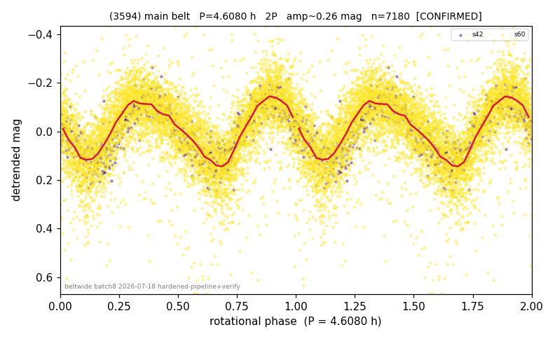

# (3594)

**Adopted:** 4.608 h, 2P, CONFIRMED

<!-- AUTO:START (regenerated from pipeline outputs; do not hand-edit this block) -->
## Evidence (auto)

Detected in 2 sector(s):

| sector | N | baseline (h) | P_phot (h) | power | FAP | cycles | flags |
|--|--|--|--|--|--|--|--|
| s42 | 721 | 185.8 | 2.3037 | 0.7394 | 9.1e-206 | 80.7 | star-cleaned:3,2P-ambiguous |
| s60 | 6493 | 611.5 | 2.3038 | 0.4026 | 0.0e+00 | 265.5 | star-cleaned:41,2P-ambiguous |

- Pipeline refine said: **1P** (folded amp_fourier 0.288); flags: sick-dips-excised:s42(1),s60(30)
- DIA (de-comb): survived_v2(ret=1.001[1.00-1.00],s42@2.304h)
- Coverage: **2 sector(s)**, best sector covers **132.71 cycles** of the adopted period. Measured periodogram peak width 0% of the period, i.e. about **+/- 0.003596 h** (1 sigma); the decimal places in the adopted value are not a precision claim.
- Factor of two: **adopted on the amplitude convention**: standard practice for an elongated body, but a convention rather than a measurement.
- Gates: FAP<1e-3 and power>=0.10 per detecting sector; >=2 sectors agree (harmonic-aware).
- **Adopted shape 2P OVERRIDES the pipeline's 1P** (doubling audit 2026-07-25: folded amplitude >= 0.25 mag, so a single-peaked curve is physically implausible; Harris convention -> 2P. The census 3-test doubling logic was measured at only 30% recall against 289 LCDB U>=2 ground-truth periods).

### Why this row reads the way it does

- folded_amp=0.24. s42 (FAP~9e-206, folded amp 0.26) and s60 (FAP~0, folded amp 0.26, robust to 1%-tail clipping of the range>3mag contamination) independently converge on P=2.3037h with a single-lobed phase curve (one min, one max) and co; P doubled 2026-07-25 (doubling audit: amp>=0.25 + Harris convention)

<!-- AUTO:END -->
