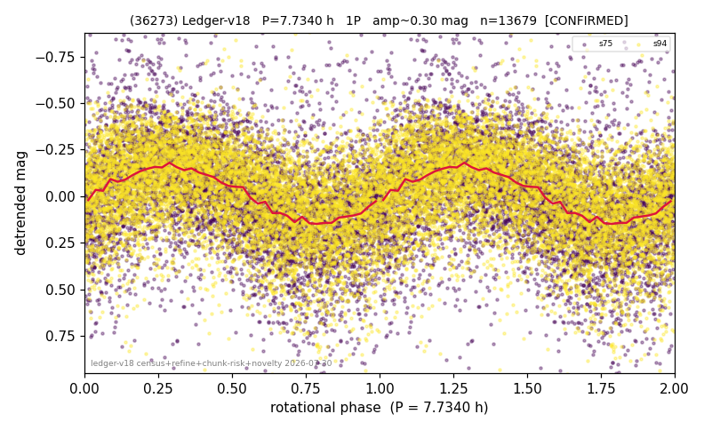

# (36273)

**Adopted:** 7.734 h, 1P, CONFIRMED

<!-- AUTO:START (regenerated from pipeline outputs; do not hand-edit this block) -->
## Evidence (auto)

Detected in 2 sector(s):

| sector | N | baseline (h) | P_phot (h) | power | FAP | cycles | flags |
|--|--|--|--|--|--|--|--|
| s75 | 6650 | 638.6 | 7.7371 | 0.1697 | 1.4e-263 | 41.3 | star-cleaned:224 |
| s94 | 7109 | 560.8 | 7.7314 | 0.1794 | 5.1e-300 | 72.5 | star-cleaned:38,2P-ambiguous |

- Pipeline refine said: **1P** (folded amp_fourier 0.373); flags: sick-dips-excised:s75(37),s94(7);near-threshold:0.37
- DIA (de-comb): **NOT RUN for this lot.** No de-comb verdict exists for this object, so momentum-dump contamination has not been excluded by that test here.
- Gates: FAP<1e-3 and power>=0.10 per detecting sector; >=2 sectors agree (harmonic-aware).
- Adopted shape: **1P** (folded-amplitude rule; pipeline agrees).

### Why this row reads the way it does

- 2 sector(s) detecting
- cross-sector fold correlation 0.96
- single-peaked at folded amp 0.373 mag

<!-- AUTO:END -->
